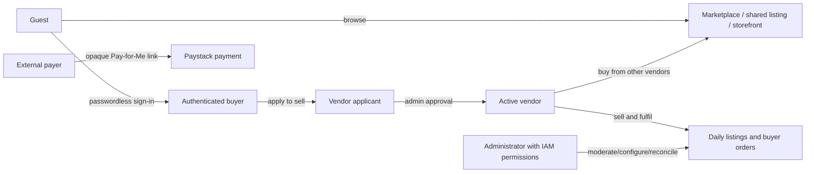
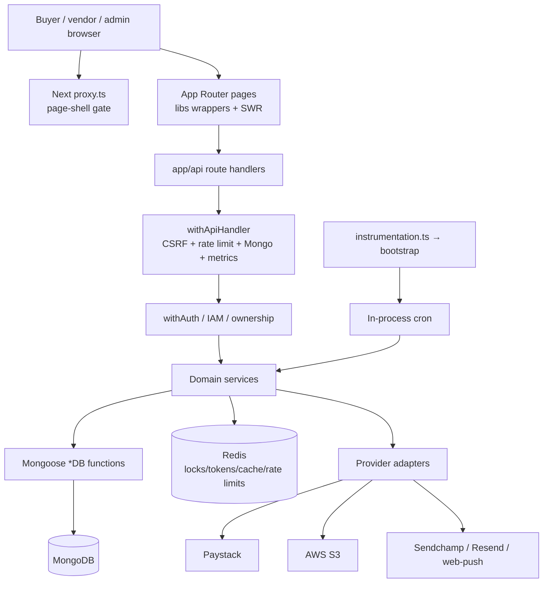
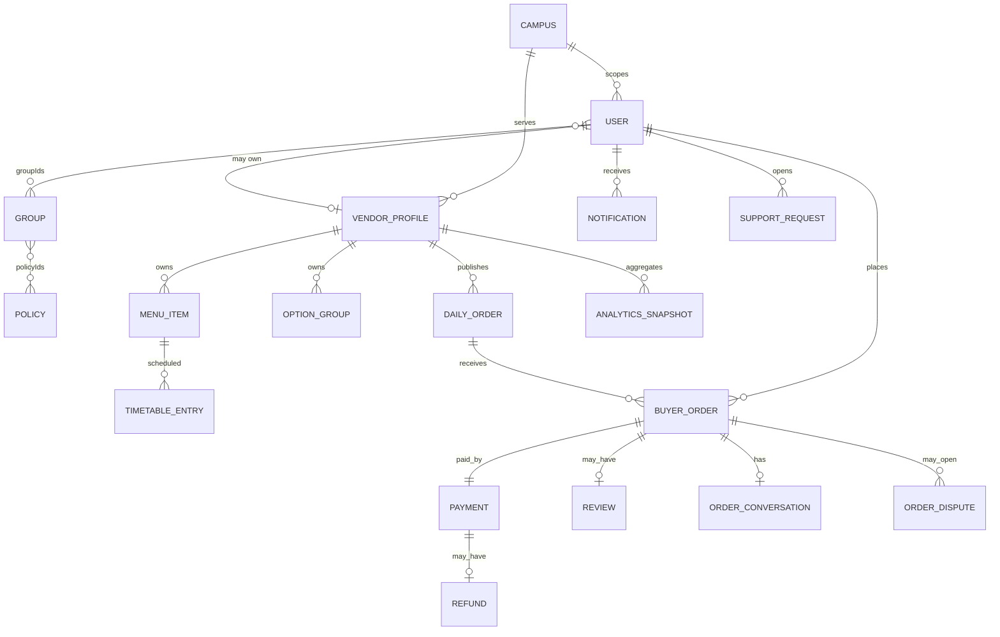
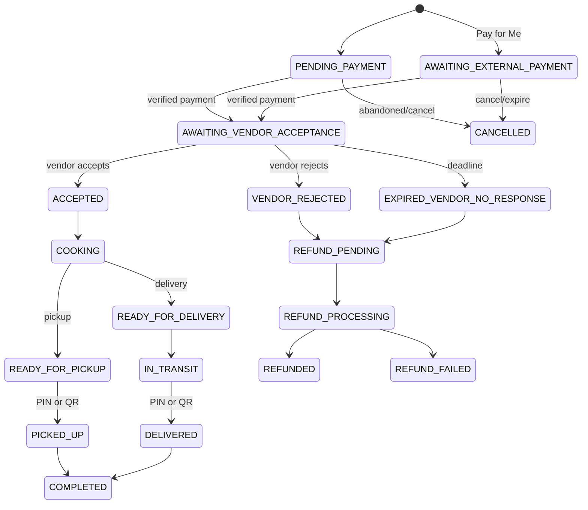

# Prechop Project Context and Agent Handover

> **Audit date:** 2026-08-05  
> **Repository:** `C:\Project\prechop`  
> **Audited branch/commit:** `main` at `745b115`  
> **Document status:** Living handover; update it when behavior, architecture, or product decisions change.

## Confidence and status legend

This document uses these labels consistently:

- **CONFIRMED** — directly supported by current repository code, configuration, tests, or Git state.
- **INFERRED** — strongly suggested by implementation but not explicitly decided or runtime-verified.
- **UNVERIFIED** — implemented or documented, but not proven in a successful current end-to-end run.
- **CONFLICT** — two repository sources disagree; both are identified.
- **MISSING** — expected capability or configuration is absent.
- **NEEDS OWNER CONFIRMATION** — a business or operational decision cannot safely be inferred.

Feature-status terms in this document are the required status vocabulary: **Implemented and verified**, **Implemented but not fully verified**, **Partially implemented**, **UI only**, **Backend only**, **Mocked or simulated**, **Planned**, **Paused**, **Missing**, and **Needs owner confirmation**. “Verified” means supported by focused tests in the repository; it does not imply this audit obtained a green full suite.

## Table of contents

1. [Document Purpose](#1-document-purpose)
2. [Executive Summary](#2-executive-summary)
3. [About the Project Owner](#3-about-the-project-owner)
4. [Product Identity](#4-product-identity)
5. [Problem Statement](#5-problem-statement)
6. [Product Vision](#6-product-vision)
7. [Target Users and Roles](#7-target-users-and-roles)
8. [Core User Journeys](#8-core-user-journeys)
9. [Functional Requirements](#9-functional-requirements)
10. [Business Rules](#10-business-rules)
11. [Product Scope Matrix](#11-product-scope-matrix)
12. [Current Product State](#12-current-product-state)
13. [Technical Stack](#13-technical-stack)
14. [Architecture](#14-architecture)
15. [Repository Structure](#15-repository-structure)
16. [Route and Screen Inventory](#16-route-and-screen-inventory)
17. [Domain Model and Data Structures](#17-domain-model-and-data-structures)
18. [Authentication and Authorization](#18-authentication-and-authorization)
19. [Payments, Fees, Refunds, and Payouts](#19-payments-fees-refunds-and-payouts)
20. [External Integrations](#20-external-integrations)
21. [Environment Variables](#21-environment-variables)
22. [UI and Design System](#22-ui-and-design-system)
23. [Testing and Quality Assurance](#23-testing-and-quality-assurance)
24. [Local Development Setup](#24-local-development-setup)
25. [Deployment and Operations](#25-deployment-and-operations)
26. [Security Review](#26-security-review)
27. [Known Bugs and Issues](#27-known-bugs-and-issues)
28. [Technical Debt](#28-technical-debt)
29. [Important Decisions Already Made](#29-important-decisions-already-made)
30. [Contradictions and Unresolved Questions](#30-contradictions-and-unresolved-questions)
31. [Development History and Completed Phases](#31-development-history-and-completed-phases)
32. [Recommended Next Steps](#32-recommended-next-steps)
33. [Guidance for the Next AI Agent](#33-guidance-for-the-next-ai-agent)
34. [Agent Start Checklist](#34-agent-start-checklist)
35. [Glossary](#35-glossary)
36. [Evidence and Source Map](#36-evidence-and-source-map)

## 1. Document Purpose

**CONFIRMED:** This document exists to give a new coding agent, developer, designer, product manager, operator, or technical partner one evidence-based map of Prechop’s product, implementation, risks, and decisions. It is intended to prevent context loss, accidental architectural rewrites, and regressions to already-rejected business rules.

Future contributors should read this document before changing code, then inspect the affected current implementation. Repository code and executable configuration remain the strongest source of truth when prose conflicts with implementation. Focused tests are strong behavioral evidence, but a test name alone does not prove the whole user journey works in the deployed environment.

Business decisions explicitly recorded here—especially integer-kobo money, server-side pricing, snapshot history, manual vendor approval, vendor-as-buyer behavior, the self-order prohibition, direct Paystack subaccount settlement, single-vendor orders, and the single-app architecture—must not be changed casually. If a change is justified, record the new decision and its consequences in this document.

## 2. Executive Summary

**CONFIRMED:** Prechop is a Nigerian campus food pre-order marketplace whose current tagline is **“Order before they cook.”** Vendors publish dated, quantity-aware meal listings with opening and cutoff times. Buyers discover those listings through a campus marketplace, vendor storefront, or shared link; choose pickup or vendor-managed delivery; and pay upfront through Paystack. The goal is to let vendors cook known quantities with less waste while buyers avoid queues and sold-out food.

The product serves buyers, vendors, and administrators in one responsive web/PWA application. A vendor account is additive: an active vendor may also buy from other vendors, but the server blocks ordering from the vendor’s own listing. Admin capabilities are permission-based through an IAM policy/group system rather than a single hard-coded role flag.

**Current stage — INFERRED:** feature-rich MVP in active integration, redesign, and hardening—not launch-ready. The repository contains broad backend and UI coverage, 667 Vitest test declarations, and 28 Playwright test declarations. However, this audit did not obtain a green verification run: lint currently reports 72 errors and 671 warnings; production/test type checks, Vitest, and the production build each exceeded the available timeout. `pnpm audit` reports 12 known vulnerabilities (6 high, 6 moderate), including Next.js 16.2.10 advisories fixed in 16.2.11.

Primary technologies are Next.js 16.2.10, React 19.2.6, TypeScript 6.0.3, MongoDB/Mongoose 9.6.2, Redis/ioredis 5.10.1, styled-components 6.4.1, SWR 2.4.1, Zod 4.4.3, Paystack, AWS S3, Sendchamp, Resend, web-push, Vitest, Playwright, and Biome.

The most important unfinished work is:

1. **P0:** patch dependency vulnerabilities and restore green quality gates.
2. **P0:** implement a safe retry/reconciliation path for failed refunds.
3. **P0:** reconcile production configuration checks with actual auth/payment/comms dependencies.
4. **P1:** perform real test-mode Paystack, email, SMS, S3, push, and deployment smoke tests.
5. **P1:** update old product/architecture documents whose auth, role, lifecycle, deployment, and feature claims no longer match the code.

The largest risks are money-recovery gaps, dependency vulnerabilities, documentation drift, best-effort in-process background work without a durable queue, missing production-provider boot checks, incomplete HTTP security headers, and an unconfirmed production hosting/deployment state.

## 3. About the Project Owner

**CONFIRMED FROM OWNER-PROVIDED CONTEXT:** The project owner and PRD author is **Aramide Jamiu Kolawole**, based in Nigeria. His relevant work spans software engineering, product development, architecture/building design, car brokerage/automotive services, and technology-driven business development. He builds practical digital products aimed primarily at Nigerian and African market problems.

His product-development approach is practical and business-oriented: begin with an MVP, preserve what works, improve in phases, and test assumptions against real operating conditions. He prefers simple, premium, modern, trustworthy, and easy-to-use interfaces over ornamental complexity.

Future agents should understand that Aramide:

- expects the repository to be inspected before changes are proposed;
- does not want previous decisions overwritten without understanding their reasons;
- often describes requirements informally, so the agent should extract and document the actual business rule;
- prefers clear explanations and detailed, ordered implementation plans;
- expects contradictions, missing logic, security problems, edge cases, and unrealistic assumptions to be surfaced honestly;
- does not want the project restarted unnecessarily;
- wants existing working behavior preserved while improvements are made; and
- expects appropriate tests, type checking, linting, and production builds before work is declared complete.

## 4. Product Identity

| Attribute | Current understanding |
|---|---|
| Official name | **Prechop / PreChop** — **CONFIRMED**, with inconsistent capitalization across files. `package.json` and README use “Prechop”; PRD/notification copy often uses “PreChop.” Normalize only after owner approval. |
| Previous names | **CONFLICT:** “Jollof” is a named visual design language/rebrand, not clearly a previous product name. The product remains Prechop in routes, package metadata, and PRD. |
| Category | Campus-scoped food pre-order marketplace; responsive web/PWA. **CONFIRMED** |
| One-sentence description | Prechop lets campus-area food vendors publish cutoff-based daily menus so buyers can reserve and pay before cooking begins. **CONFIRMED** |
| Tagline | “Order before they cook.” **CONFIRMED** |
| Brand positioning | Nigerian, food-forward, practical, trustworthy, mobile-first, and designed around WhatsApp-driven campus commerce. **CONFIRMED/INFERRED** |
| Geographic focus | Nigerian university campuses and nearby communities first; broader African expansion is a future idea. **CONFIRMED FROM DOCS** |
| Platforms | Responsive web, mobile web/PWA, buyer surface, vendor dashboard, admin portal, and same-app HTTP API. No native app. **CONFIRMED** |
| Deployment status | Docker and GitHub Actions exist; Git history mentions Vercel preparation; documentation also discusses ECS/Railway/Fly/VPS/Amplify. No provider-specific live deployment config or verifiable live release record exists. **NEEDS OWNER CONFIRMATION** |
| Development stage | Feature-rich MVP/integration and hardening. **INFERRED** |

**Brand conflict:** The June PRD specifies green `#1B8A4C`, orange `#F47C20`, Clash Display, and Inter. Current `src/styles/global.ts` implements the later “Jollof” system: pepper orange `#FF5A1F`, palm green `#1F9D57`, plantain gold `#F4B400`, cream/charcoal themes, Bricolage Grotesque, and Plus Jakarta Sans. Current code is the UI source of truth.

## 5. Problem Statement

**CONFIRMED FROM PRODUCT DOCUMENTATION:** Many Nigerian campus food sellers manage pre-orders through WhatsApp Status and direct messages. That approach is familiar but weak at structured menus, quantities, cutoff enforcement, payment tracking, fulfillment state, audit trails, and discovery outside the seller’s existing contacts.

The buyer problem is uncertainty: meals sell out, queues waste time, vendor availability is unclear, menus are fragmented across social feeds, and payment/collection coordination is manual. The vendor problem is demand uncertainty: cooking before confirmed orders creates waste; accepting orders manually creates errors; and reaching new buyers is difficult.

Prechop is different because it combines two discovery paths—shareable vendor links for warm audiences and a campus marketplace for cold discovery—with server-enforced order windows, capacity holds, server-computed prices, upfront payment, fulfillment tracking, and direct vendor settlement.

Local-market realities reflected in the repository include:

- Naira/kobo accounting and Paystack bank/subaccount APIs;
- Nigerian phone normalization and Sendchamp SMS;
- campus and school scoping, including on-campus and off-campus vendors;
- WhatsApp/Telegram link sharing and a curated WhatsApp-TV directory;
- vendor-managed delivery rather than a platform rider network;
- low-friction, passwordless sign-in;
- mobile-first navigation and PWA push; and
- trust controls: vendor documentation, manual admin approval, ratings threshold, handover PIN/QR, disputes, refunds, audit logs, and account suspension.

**UNVERIFIED:** The actual connectivity, data-cost, SMS-delivery, bank-settlement, chargeback, and campus logistics assumptions have not been validated by repository evidence from a live pilot.

## 6. Product Vision

### Current scope

**CONFIRMED:** A campus-scoped, single-vendor-per-order marketplace covering buyer discovery and ordering, vendor onboarding/catalog/listings/fulfillment, Paystack payment and refunds, vendor-managed pickup/delivery, reviews, notifications, support, disputes, analytics, and permission-based administration.

### Immediate MVP objective

**INFERRED FROM PRD AND IMPLEMENTATION:** Enable one or a small number of Nigerian campuses to onboard legitimate vendors, publish real daily listings, accept real paid orders safely, fulfill them with auditable handover, and resolve exceptions without manual spreadsheets or chat-only coordination.

Success would mean real vendors can complete onboarding, pass review, configure payout details, publish, receive paid orders, fulfill them, and receive correct Paystack split settlement; buyers can discover, pay, receive food, obtain receipts, and recover funds when warranted; and admins can observe and intervene. The repository does not define a single current KPI contract. The older v2 projection tables are business hypotheses, not verified outcomes.

### Future scope found in documentation

- On-platform WhatsApp-TV accounts, boost payments, and a platform commission.
- Multi-vendor cart.
- Minimum-order policy (platform-wide or vendor-specific remains undecided).
- Multi-campus and later beyond-campus/African expansion.
- Premium vendor features, advanced analytics, priority support, and institutional partnerships.
- Possible native push/app expansion; current code is web-push PWA only.
- External scheduling if hosted on a serverless platform.

### Paused/rejected/out-of-current-scope

- **CONFIRMED REJECTED:** separate Fastify API, Prisma/PostgreSQL runtime, BullMQ worker, RS256 JWT, Supabase Realtime, and separate worker deploy.
- **CONFIRMED PAUSED:** partial refunds; the action enum exists but the service explicitly rejects them.
- **CONFIRMED FUTURE:** multi-vendor cart and paid WhatsApp-TV boosts.
- **CONFIRMED NOT CURRENT:** platform-managed delivery/rider network, escrow wallet, internal vendor payout ledger, first-payout hold, native app, and microservices split.
- **Do not introduce now without approval:** multi-vendor checkout, platform-held balances, first-payout delay, an extra backend service, or a second job-worker process.

## 7. Target Users and Roles



### Guest

- **Who/goals:** unauthenticated visitor browsing vendors, reviews, marketplace listings, policies, shared order links, or Pay-for-Me requests.
- **Permissions:** read public marketplace/storefront/listing/review/campus/config data; initialize an opaque external-payment link.
- **Limitations:** must authenticate before placing an order, saving data, reviewing, subscribing to push, or accessing personal history.
- **Auth:** none.

### Authenticated buyer

- **Who/goals:** student, staff member, off-campus resident, or other community buyer; not restricted to students.
- **Permissions:** universal authenticated actions include creating/reading own orders and creating eligible reviews; may change to an active campus.
- **Onboarding:** current code creates buyers through email magic link or verified Google email, derives a display name, and assigns the Buyers IAM group when available.
- **Auth:** passwordless email link or Google OAuth; HS256 access/refresh cookie session.
- **Rules:** one vendor per order, cannot manipulate server prices, and may access only owned order/support/notification resources.

### Vendor applicant

- **Who/goals:** student cook, campus stall, restaurant, or bakery completing identity, location, category, image/document, bank, and delivery settings.
- **Permissions:** applicant profile endpoints; selling functions remain status-gated.
- **Onboarding:** buyer becomes a vendor, completes required fields/documents, Paystack account resolution/subaccount, submits, then waits for admin approval or requested changes.
- **Rules:** completeness is display-only; admin approval is required. Required verification documents depend on vendor/bakery type.

### Active vendor

- **Who/goals:** sell scheduled food, manage availability/capacity, receive and fulfill orders, view analytics/reviews/earnings, and buy from other vendors.
- **Permissions:** additive vendor IAM plus universal buyer actions; seller mutations resolve the caller’s vendor profile and ownership.
- **Limitations:** cannot order from own listings; cannot enable open status unless active; delivery remains vendor-managed; no internal withdraw/payout action exists.
- **Security:** optional/required post-approval security PIN flow protects handover-related operations; forgot-PIN includes email/support/admin authorization paths.

### Administrator

- **Who/goals:** platform operations, vendor approval/suspension, campus/school management, catalog/order/payment/revenue oversight, reviews, support, disputes, notifications, audit, site settings, IAM, and WhatsApp-TV administration.
- **Permissions:** IAM groups/policies/statements with explicit actions such as `refund:create`, `order:read`, or `siteConfig:update`. Admin URL prefix also invokes `assertAdministrator` in the common handler.
- **Limitations:** permission-specific; “administrator” group membership does not imply every UI action unless its policy grants the action.
- **Auth:** same passwordless user session; admin redirect is based on group membership.

### External payer

- **Who/goals:** person paying for a buyer’s order through an opaque Pay-for-Me token.
- **Permissions:** view and initialize that payment request only.
- **Auth:** possession of a hashed, expiring bearer token; no account required.
- **Limitations:** cannot edit the order; request expires and slot holds can lapse.

**CONFLICT:** Older docs describe phone+OTP as the only login and fixed `BUYER|VENDOR|SUPER_ADMIN` roles. Current code uses email/Google sign-in and IAM groups; vendor is additive to a user rather than a mutually exclusive buyer role. `UserRole` remains in an enum, but the `users` model stores `groupIds` and `directPolicyIds`, not a role field.

## 8. Core User Journeys

### 8.1 Passwordless registration/login

- **Entry:** `/login`; public.
- **Actions/UI:** choose Google or email. Email posts to `/api/auth/email/request`; Google starts at `/api/auth/google` (duplicate start/callback routes also exist).
- **Backend/data:** Redis stores hashed email-link tokens for 1 hour or OAuth state for 10 minutes. New users are created by normalized email, assigned Buyers group if IAM bootstrap exists, and receive access/refresh JWT cookies.
- **Success:** redirect to safe `next` path, `/marketplace`, or `/admin` for administrators.
- **Failure:** missing Resend/Google config, expired link/state, inactive user, Redis failure, or cookie/session failure.
- **Known gaps:** production boot does not require Resend or Google configuration; `.env.example` omits Google variables. Phone/OTP code/docs remain in older assumptions but are not the current login UI.

### 8.2 Become a vendor and get approved

- **Entry:** `/sell`, `/account`, then `/vendor/onboarding`; authenticated buyer.
- **Actions:** become vendor; enter business identity/type, location/campuses, categories, profile image, type-specific verification documents, Paystack bank account; submit for review.
- **Backend:** `/api/users/me/become-vendor`, `/api/vendors/me/**`, Paystack bank resolve/subaccount, S3 presign/confirm, `submitForReview`.
- **Data/status:** `VendorProfile` moves `INCOMPLETE → PENDING_REVIEW → ACTIVE` or `CHANGES_REQUESTED → PENDING_REVIEW`; admin can later `SUSPENDED ↔ ACTIVE`.
- **Notifications:** Resend/in-app/audit events are wired but email is skipped outside production.
- **Failure:** missing checklist/document, Paystack failure, unsupported document, inactive campus, or duplicate submission.
- **Known gap:** a green real-provider onboarding run was not obtained.

### 8.3 Create menu and timetable

- **Entry:** `/menu`, `/menu/new`, `/menu/[itemId]/edit`, `/timetable`; active vendor.
- **Actions:** CRUD/soft-delete menu items, variants, option groups, images, availability/sold-out, reorder; assign menu items to weekdays.
- **Backend/data:** `/api/menu/**`, `/api/timetable/**`; `MenuItem`, `OptionGroup`, `TimetableEntry`.
- **Rules:** ownership rechecked; addon groups allowed for MEALS; prices enter as Naira and store as integer kobo; historical snapshots remain unchanged.
- **Known gaps:** image uploads have MIME allowlists but no enforced upload size and image confirmation does not verify object existence.

### 8.4 Publish a daily order

- **Entry:** `/dashboard/new` or timetable template; active vendor.
- **Actions:** choose date/open/cutoff, items/variants/options/caps, pickup/delivery details, public status; publish and share link.
- **Backend/data:** `POST /api/daily-orders`, `/from-template`, PATCH/close/cancel routes; creates snapshotted `DailyOrder.items` and an opaque share token.
- **Status:** `DRAFT → ACTIVE → CLOSED` or `CANCELLED`; terminal listings cannot be edited.
- **Failure:** vendor inactive/closed, invalid time window, no valid items, invalid delivery acknowledgement, ownership mismatch.

### 8.5 Browse/search and storefront

- **Entry:** `/marketplace`, `/v/[vendorId]`, `/o/[shareableToken]`; public to view.
- **Backend:** marketplace/search/public/storefront/review APIs; site-config marketplace flag.
- **Rules:** campus/state filtering, active/open vendor and active/public listing visibility, cutoff/open-window state, own listings excluded for vendor buyers, rating withheld until 5 reviews.
- **Success:** buyer opens a current listing or vendor storefront.
- **Known gaps:** docs still describe a simpler campus-only feed; current code includes broader state/search behavior.

### 8.6 Place an order and self-pay

- **Entry:** `/o/[shareableToken]`; authenticate before checkout.
- **Actions:** select quantities, variant/options, pickup or delivery, address/message; post `/api/orders`; redirect to Paystack.
- **Backend/data:** validates listing/vendor/window and self-order rule, recomputes all prices, reserves capacity in Redis, initializes Paystack split, transactionally creates `BuyerOrder` and `Payment` in Mongo.
- **Status:** `PENDING_PAYMENT` initially; current paths also use `AWAITING_EXTERNAL_PAYMENT` for Pay-for-Me.
- **Success:** Paystack callback to `/order/confirmation`; authoritative settlement occurs through webhook/confirm verification.
- **Failures:** cutoff/open time, closed vendor/listing, own listing, capacity, invalid options/delivery, Mongo transaction topology, Paystack initialization, or reservation expiry.

### 8.7 Pay for Me

- **Entry:** buyer chooses `PAY_FOR_ME`, receives `/pay/[token]`; external payer need not sign in.
- **Data:** hashed token and expiry stored on `Payment`; order awaits external payment.
- **Actions:** payer views summary, supplies contact, initializes Paystack; buyer can cancel before payment.
- **Safety:** opaque hashed token, amount/order comparison, reservation-expiry check, one authorization URL, same webhook verification.
- **Known gap:** email/contact fallback behavior and real external payer flow are not currently E2E-verified.

### 8.8 Payment webhook and confirmation

- **Entry:** `POST /api/webhook/paystack` with raw body; `POST /api/payments/confirm` for authenticated callback recovery.
- **Checks:** HMAC-SHA512, supported event, reference, provider verification where needed, currency/domain/amount/metadata checks, payment/order consistency, atomic first-claim via `webhookVerified:false`.
- **Data/status:** payment `SUCCESS`, order moves into paid/vendor-acceptance flow, inventory commits once, slot locks release, notifications dispatch.
- **Failure recovery:** late success after cancellation/expiry triggers refund attempts; anomalies open admin attention/disputes.
- **Risk:** no durable event queue; provider and DB partial-failure paths rely on idempotency, logs, disputes, and cron reconciliation.

### 8.9 Vendor fulfillment and handover

- **Entry:** `/pipeline`, `/dashboard/[orderId]`, buyer `/my-orders/[orderId]`.
- **Typical pickup:** `AWAITING_VENDOR_ACCEPTANCE → ACCEPTED → COOKING → READY_FOR_PICKUP → PICKED_UP → COMPLETED`.
- **Typical delivery:** `AWAITING_VENDOR_ACCEPTANCE → ACCEPTED → COOKING → READY_FOR_DELIVERY → IN_TRANSIT → DELIVERED → COMPLETED`.
- **Backend:** incoming/daily-order order APIs, status, ready estimate, handover, contact, no-show/unreachable/delivery-failed, conversation routes.
- **Handover:** buyer reveals QR/PIN only when eligible; vendor confirms; hashes, attempt counter, temporary lock, and audit fields are stored.
- **Exceptions:** vendor rejection/no-response triggers refund states; pickup no-show, buyer unreachable, delivery failure, late order, dispute, and admin support paths exist.
- **Known conflict:** older 8-state docs are obsolete.

### 8.10 Cancellation/refund/dispute

- **Buyer/vendor cancellation:** allowed from configured early states; paid orders funnel to `issueRefund`.
- **Admin:** full refunds only via `refund:create`; partial refunds explicitly rejected even though the enum/UI contract includes the action.
- **Idempotency:** unique refund per payment prevents duplicate payout.
- **Critical gap:** once Paystack fails, the retained `REFUND_FAILED` record causes later calls to return `REFUND_FAILED` without retrying Paystack. There is no implemented retry endpoint/job.
- **Disputes:** exception services snapshot order, payment, timeline, handover, messages, and evidence; admin may request evidence, uphold/reject, or issue full refund.

### 8.11 Reviews, receipts, notifications, support

- **Reviews:** completed own order, once, within configurable 72 hours; reporting flags, admin removal recomputes rating.
- **Receipts:** completion triggers genuine PDF generation, private S3 storage, email, and authenticated/public-token read paths; receipt state is `PENDING|READY|FAILED`.
- **Notifications:** Mongo in-app notifications plus best-effort email/SMS/push; delivery attempts recorded for some channels; push subscriptions prune gone endpoints.
- **Support/chat:** support tickets and messages are persisted; order conversations are participant/administrator scoped and use SWR polling rather than sockets.

## 9. Functional Requirements

| Domain | Requirement | Status | Confidence/evidence |
|---|---|---|---|
| Authentication | Email magic-link sign-in | Implemented and verified | **CONFIRMED** focused auth tests; Resend live send unverified |
| Authentication | Google OAuth sign-in | Implemented but not fully verified | **CONFIRMED** code; no focused live OAuth E2E |
| Authentication | Phone/OTP login | Paused / documentation legacy | **CONFLICT** docs/env mention it; current login UI does not expose it |
| IAM | Groups, policies, direct policies, deny/allow resolution | Implemented and verified | **CONFIRMED** models/services/admin UI and IAM tests |
| Profiles | Buyer profile and campus switch | Implemented and verified | **CONFIRMED** services/tests |
| Vendor onboarding | Identity/location/categories/bank/image/documents/review | Implemented but not fully verified | **CONFIRMED**, external providers unverified |
| Marketplace | Browse, state/campus selection, search, storefront | Implemented and verified | **CONFIRMED** service and E2E coverage declarations |
| Menu | Items, variants, option groups, availability, sold-out, images | Implemented and verified | **CONFIRMED** broad tests; upload integration unverified |
| Timetable | Weekly entries/templates | Implemented and verified | **CONFIRMED** code/tests |
| Daily listings | Draft/publish/edit/close/cancel/share | Implemented and verified | **CONFIRMED** service tests |
| Ordering | Server pricing, capacity, pickup/delivery, snapshots | Implemented and verified | **CONFIRMED** extensive service tests |
| Pay for Me | External bearer-token payment request | Implemented but not fully verified | **CONFIRMED** code/tests, no live provider proof |
| Payments | Paystack split init, verify, webhook, idempotency | Implemented and verified | **CONFIRMED** adapter/service tests; live flow **UNVERIFIED** |
| Refunds | Full refunds with unique reconciliation row | Partially implemented | **CONFIRMED** success/idempotency; failed-refund retry **MISSING** |
| Payouts | Direct Paystack subaccount settlement | Backend only | **CONFIRMED** split parameters; no payout ledger/reconciliation/webhook |
| Fulfillment | Acceptance, cooking, pickup/delivery, QR/PIN | Implemented and verified | **CONFIRMED** services/constants/tests |
| Exceptions | Late, no-show, unreachable, failed delivery | Implemented and verified | **CONFIRMED** services/tests |
| Conversations | Buyer/vendor/admin order chat | Implemented and verified | **CONFIRMED** persisted polling conversation tests |
| Disputes | Evidence snapshot and admin resolution | Partially implemented | **CONFIRMED** full refund; partial refund deliberately missing |
| Reviews | Create/report/moderate/public threshold | Implemented and verified | **CONFIRMED** tests |
| Notifications | In-app, SMS, email, web-push | Implemented but not fully verified | **CONFIRMED** code; real providers **UNVERIFIED** |
| Receipts | PDF, S3, email, download | Implemented and verified | **CONFIRMED** real PDF tests with only network edges mocked |
| Support | User/admin tickets and messages | Implemented but not fully verified | **CONFIRMED** code; limited E2E evidence |
| Admin | Vendors, onboarding, orders, payments, revenue, catalog, settings | Implemented but not fully verified | **CONFIRMED** UI/API/tests |
| Analytics | Vendor/admin analytics and daily snapshots | Implemented but not fully verified | **CONFIRMED** code; production cron not observed |
| WhatsApp TV | Campus directory/admin CRUD | Implemented and verified | **CONFIRMED** Phase 1 manual/off-platform only |
| PWA | Manifest, service worker, push subscription | Implemented but not fully verified | **CONFIRMED** assets/code; install/push live unverified |
| Monitoring | Health and Prometheus metrics | Implemented but not fully verified | **CONFIRMED** endpoints/tests; no deployed collector |
| Native mobile | Native application | Missing | **CONFIRMED** web/PWA only |

## 10. Business Rules

### Money and payment

1. **CONFIRMED:** all stored/computed money is integer kobo; Naira is display/input formatting only.
2. **CONFIRMED:** clients submit identifiers and quantities; the server resolves snapshots and prices.
3. **CONFIRMED:** buyer service fee is 3% of food subtotal capped at ₦200 by default; vendor commission is 8% of food subtotal; both are configurable through `siteConfigs` with env/default fallback.
4. **CONFIRMED:** `vendorSettlementKobo = food subtotal + delivery fee - vendor commission`, floored at zero. Paystack processing fees are borne by the platform side through `bearer:"account"`.
5. **CONFIRMED:** one payment per buyer order; unique Paystack reference and idempotency key.
6. **CONFIRMED:** Prechop does not hold a wallet balance. Paystack splits directly to the vendor subaccount. No “pending payout balance” should be shown.
7. **CONFIRMED:** only full refunds are safe in v1; partial refund actions must remain rejected until the data/state model changes.

Example: for a ₦5,000 food subtotal and ₦500 delivery, default buyer fee is ₦150; buyer pays ₦5,650. Vendor commission is ₦400; vendor settlement instruction is ₦5,100. Values are represented as `500000`, `50000`, `15000`, `40000`, and `510000` kobo.

### Listing, capacity, and visibility

8. **CONFIRMED:** order placement is valid only after `availableFrom`, before `cutoffTime`, on an active/public listing, and while the vendor is active and open.
9. **CONFIRMED:** cutoff is enforced synchronously; cron is reconciliation, not the primary guard.
10. **CONFIRMED:** item capacity may be unlimited or capped. Redis holds capacity during pending payment; committed inventory increments once after verified payment.
11. **CONFIRMED:** daily order and buyer order items are snapshots; later menu edits do not rewrite history.
12. **CONFIRMED:** an active vendor can buy from another vendor but never from their own listing; own listings are hidden and server-blocked.
13. **CONFIRMED:** rating is not sent publicly until at least five reviews; “New Vendor” is used before that.

### Vendor and campus

14. **CONFIRMED:** vendor completeness is informational; it must never auto-activate or gate submission.
15. **CONFIRMED:** submission uses the achievable onboarding checklist and required documents; admin approval alone activates the vendor.
16. **CONFIRMED:** only active vendors can turn on open status or publish/manage selling resources.
17. **CONFIRMED:** tenant scoping is application-enforced. Every ownership and campus filter is load-bearing; MongoDB has no RLS.
18. **CONFIRMED:** suspension also deactivates the linked user; reactivation reverses it and is audited.

### Fulfillment, cancellation, review, and moderation

19. **CONFIRMED:** vendor acceptance has a deadline and reminders; rejection/no-response initiates refund handling.
20. **CONFIRMED:** vendor progression depends on pickup versus delivery. QR/PIN handover is one-time, hashed, attempt-limited, and eligible only at the appropriate fulfillment stage.
21. **CONFLICT:** old docs allow cancellation only from `PAID|CONFIRMED`; current code also handles new states such as `AWAITING_EXTERNAL_PAYMENT`, `AWAITING_VENDOR_ACCEPTANCE`, and `ACCEPTED`, with actor-specific rules. Current service code controls.
22. **CONFIRMED:** completed orders can be reviewed once within the configured review window (default 72 hours); reviews are immutable.
23. **CONFIRMED:** vendor report only flags a review; it does not change the rating. Admin removal/unflag is permission-controlled and audited.
24. **CONFIRMED:** audit logs are append-only by convention/API surface, not protected by database-level immutability.
25. **CONFIRMED:** critical state changes should not fail solely because a notification fails; delivery is best effort.

## 11. Product Scope Matrix

| Feature | Intended Behaviour | Current Implementation | Status | Evidence | Gaps | Priority |
|---|---|---|---|---|---|---|
| Passwordless auth | Low-friction secure account access | Email link + Google; JWT cookies and rotation | Implemented but not fully verified | `services/auth`, `/api/auth/**`, `LoginWrapper` | Provider config and old phone docs | P0 |
| Vendor application | Legitimate vendors submit evidence and payout account | Type-aware documents, Paystack, admin review | Implemented but not fully verified | vendor services/routes/admin onboarding | Real-provider run | P1 |
| Marketplace | Campus/state discovery plus shared links | Feed/search/storefront/public listing | Implemented and verified | marketplace services/tests/E2E declarations | Performance/load proof | P2 |
| Catalog/options | Reusable menu with variants/addons | Full CRUD, option groups, snapshots | Implemented and verified | menu models/services/tests | Upload limits | P1 |
| Daily listings | Dated order windows and capacity | Draft/active/close/cancel/share | Implemented and verified | dailyOrders domain/tests | Docs lag | P2 |
| Checkout | Secure single-vendor pricing/capacity | Redis hold + Mongo transaction + Paystack | Implemented and verified | `placeOrder`, tests | Live Paystack proof | P0 |
| Pay for Me | Third party pays from expiring link | Hashed token flow | Implemented but not fully verified | payment request routes/services | Live E2E | P1 |
| Split settlement | Vendor paid directly | Paystack transaction split | Backend only | Paystack adapter | Settlement/reconciliation visibility | P1 |
| Refunds | Idempotent buyer recovery | Full refund + row + statuses | Partially implemented | `issueRefund`, admin refunds | No failed-refund retry | P0 |
| Fulfillment | Explicit pickup/delivery lifecycle | Acceptance, cooking, delivery, handover | Implemented and verified | lifecycle/services/tests | Docs obsolete | P1 |
| Exceptions/disputes | Evidence-driven admin resolution | No-show/unreachable/failure/dispute records | Partially implemented | exception/dispute modules | Partial refunds, ops UX validation | P1 |
| Chat/support | Order communication and support queue | Persisted messages, admin support | Implemented but not fully verified | conversation/support modules | Polling only; limited E2E | P2 |
| Notifications | Reliable multichannel updates | In-app + best-effort SMS/email/push | Implemented but not fully verified | providers/notification services | No durable retries/provider monitoring | P1 |
| Reviews | Trustworthy ratings/moderation | Window, uniqueness, threshold, flag/remove | Implemented and verified | review services/tests | Live moderation QA | P2 |
| Analytics | Vendor/platform operational insight | snapshots and query dashboards | Implemented but not fully verified | analytics models/services/cron | Cron/deployed accuracy proof | P2 |
| Admin/IAM | Least-privilege operations | granular policies/groups and broad admin UI | Implemented and verified | IAM/admin code/tests | UX/security review | P1 |
| WhatsApp-TV boosts | Help vendors distribute links | Manual campus directory only | Partially implemented | WhatsAppTv modules | No accounts/payments/commission | P3 |
| Native app | Native mobile client | None | Missing | no native project | Product decision | P3 |

## 12. Current Product State

### Working by implementation and focused-test evidence

Core data models, IAM resolution, vendor lifecycle, catalog/options/timetable, daily listings, capacity math, server pricing, payment verification/idempotency, order lifecycles, handover, refund success/idempotency, reviews, receipts, marketplace/search, vendor-as-buyer, admin modules, and runtime-config guards have focused test coverage.

### Appears working but remains unverified end to end

Real Google OAuth, Resend sign-in/transactional email, Sendchamp delivery, S3 direct uploads, VAPID push, live Paystack split/settlement/refund, cron behavior under multiple real instances, Docker deployment, production health/metrics scraping, and browser installation as a PWA.

### Partial, broken, or mocked

- Failed-refund recovery is broken as a retry workflow.
- Partial refund is intentionally rejected despite being present in the dispute action vocabulary.
- Test suites mock provider network edges; this is appropriate for tests but not proof of production integration.
- Dev email sending is deliberately skipped and returns a `devLink`; dev SMS logs to console.
- Seed placeholder subaccounts cause unsplit test-mode charges outside production; production refuses that fallback by sending the invalid split to Paystack and failing loudly.
- In-process asynchronous notification/receipt work lacks durable queue guarantees.

### Not started or external-dependency blocked

Native app, multi-vendor cart, paid WhatsApp-TV marketplace, internal payout/settlement reconciliation, Sentry, load testing, infrastructure-as-code, a documented backup restore test, and a confirmed live hosting target.

### Requires owner decisions

Production host/status, canonical domain (`prechop.ng` vs `prechop.com.ng`), canonical capitalization, minimum-order policy, first launch campus, final auth policy (email/Google versus retaining phone OTP), and which future monetization items remain approved.

## 13. Technical Stack

| Layer | Technology/version | Actual use |
|---|---|---|
| Runtime | Node `>=20.11.0`; package manager pnpm `9.15.0` | Active; exact deployed Node **UNVERIFIED** |
| Language | TypeScript `6.0.3`, strict, bundler resolution | Active |
| Framework | Next.js `16.2.10` App Router | Active; page + API monolith |
| UI | React/React DOM `19.2.6` | Active |
| Styling | styled-components `6.4.1`, CSS variables, SSR registry | Active custom design system |
| Client data/state | SWR `2.4.1`; React local/context state | Active; no Redux/global store |
| Animation/icons/forms | motion `12.38.0`, react-icons `5.6.0`, react-select `5.10.2`, react-phone-number-input `3.4.16` | Active/partly legacy phone UI |
| Validation | Zod `4.4.3`, validator `13.15.35` | Active |
| Backend | Next route handlers → services → Mongoose model functions | Active modular monolith |
| Database | MongoDB; Mongoose `9.6.2` | Active; replica set required for transactions |
| Cache/ephemeral | Redis; ioredis `5.10.1` | Active for auth tokens, rate limits, locks, cache, cron coordination |
| Auth | jose `6.2.3`, jsonwebtoken `9.0.3`, bcrypt `6.0.0`, Node crypto | Active |
| Payment | Paystack over axios `1.16.0` | Active adapter; live mode unverified |
| Storage | AWS SDK S3 `3.1045.0` packages | Active adapter; live mode unverified |
| Email | Resend `4.5.1` | Production-only sending; unverified live |
| SMS | Sendchamp over axios | Production behavior; dev console sink |
| Push/PWA | web-push `3.6.7`, service worker, manifest | Active but unverified live |
| PDF/QR | `@react-pdf/renderer 4.5.1`, `qrcode 1.5.4` | Active receipts/handover |
| Images | sharp `0.34.5` direct and via Next | Listed/externalized; direct processing use is limited |
| Background | cron `4.4.0` in app process | Active, Redis-locked |
| Observability | prom-client `15.1.2`; console logging | Metrics active; no Sentry/structured logger package |
| Unit/integration | Vitest `4.1.10`, V8 coverage | Active |
| E2E | Playwright `1.60.0` manifest range (lockfile may resolve newer) | Active, Chromium/serial |
| Lint/format | Biome `2.4.15` | Active but currently failing |
| Build/deploy | Next build/start, Docker multi-stage, Compose, GitHub Actions | Active config; deployment target unconfirmed |
| Analytics | Internal Mongo snapshots | Active; no third-party product analytics found |

**Documentation-only/outdated stack claims:** Prisma/Postgres, Fastify, BullMQ, Termii, Supabase Realtime, Cloudinary, Pino, AWS Secrets Manager, CloudWatch, Sentry, Terraform, Amplify files, and a standalone Next output are not current repository implementations.

## 14. Architecture

### Style and dependency direction

Prechop is a single-deploy modular monolith. Client pages and feature wrappers call route handlers through an axios base client/SWR. Route handlers apply common security/readiness/metrics wrappers, validate inputs, enforce authentication/permission/role, and delegate to services. Services own business rules and provider orchestration. Mongoose `*DB` functions own persistence. Providers isolate Paystack, S3, Sendchamp, Resend, and web-push.



There is no formal repository-interface/adapter inversion layer: services import concrete model functions and provider singletons. The “repository pattern” is a naming/layering convention (`*DB`), not dependency injection. Tests replace provider functions with spies/mocks at module boundaries.

Background work runs in the Next Node process. Global cron locks coordinate instances; per-order/listing guards and idempotent updates reduce duplicates. There is no message broker, durable job queue, dead-letter queue, or webhook-event table.

Feature/runtime flags live in the singleton `siteConfigs`: marketplace/reviews/WhatsApp-TV enablement, order/payment kill switches, fees, timeouts, and informational completeness threshold. Config caching is short-lived. Environment-specific behavior includes dev email skip, dev SMS console logging, seed subaccount unsplit fallback, production cookie names/security, and stricter boot assertions.

## 15. Repository Structure

```text
prechop/
├─ .github/workflows/ci.yml      # Static, test, build, audit, and Playwright jobs
├─ docs/                         # PRDs, architecture/domain/ops docs, this handover
│  ├─ architecture/              # Target architecture/config/deployment descriptions
│  ├─ data-and-api/              # Model/API/auth references (partly stale)
│  ├─ delivery/                  # ADRs, testing, conventions, runbook
│  ├─ product/                   # Business rules/state/sequence docs (partly stale)
│  └─ superpowers/specs/         # Dated feature/design decisions
├─ e2e/                          # Playwright fixtures and 11 journey specs
├─ public/                       # PWA manifest/SW/icons, branding, sitemap, seed images
├─ scripts/                      # Dev/prod seed, IAM/category migrations, admin promotion
├─ src/
│  ├─ app/                       # 52 page routes and ~133 API route files
│  │  ├─ admin/                  # Admin portal pages
│  │  ├─ api/                    # HTTP adapters grouped by domain
│  │  └─ policies/               # Public policy/help content
│  ├─ components/                # Shared design-system primitives
│  ├─ constants/                 # Client-safe API, fees, status, formatting
│  ├─ hooks/                     # Auth/toast/saved/fee client hooks
│  ├─ layouts/                   # AppShell and AdminShell
│  ├─ libs/                      # Screen-level feature wrappers and complex UI
│  ├─ server/
│  │  ├─ constants/              # Env, errors, crypto, fees, cron, permissions
│  │  ├─ databases/              # Mongo/Redis singletons and locks
│  │  ├─ lib/                    # API wrapper, auth, cookies, CSRF, rate limiting
│  │  ├─ models/                 # Mongoose schemas and *DB functions
│  │  ├─ providers/              # Paystack, S3, Sendchamp, Resend, push adapters
│  │  ├─ services/               # Domain orchestration/business logic
│  │  ├─ validators/             # Zod schemas
│  │  ├─ metrics/                # Prometheus metrics
│  │  └─ runtime/bootstrap.ts    # Config, DB, IAM, cron, shutdown composition
│  ├─ styles/global.ts           # Jollof theme tokens and global CSS
│  ├─ types/                     # Browser/API shared shapes
│  └─ proxy.ts                   # Next 16 page-shell authentication gate
├─ tests/                        # 68 Vitest files, scratch Mongo/Redis helpers
├─ compose.yaml                  # Local production-image + isolated test Mongo profile
├─ Dockerfile                    # Non-root multi-stage production image
├─ package.json / pnpm-lock.yaml # Scripts and exact dependency graph
└─ *config.*                     # Next, Biome, Vitest, Playwright, sitemap, TypeScript
```

Two root `vendor-dashboard-*-mockup.html` files are design artifacts, not application routes. `scripts/seed.ts` contains a current production-safe seed followed by a very large commented legacy seed body; treat the commented body as dead reference, not live behavior.

## 16. Route and Screen Inventory

### Pages

| Route(s) | Audience | Purpose | Authentication | Main component(s) | Backend dependency | Current status |
|---|---|---|---|---|---|---|
| `/` | Public | Landing/brand/CTAs | Optional | inline landing page | auth context | Implemented |
| `/login` | Guest | Email/Google sign-in | Public | `LoginWrapper` | `/api/auth/**` | Implemented; external config unverified |
| `/marketplace` | Public/buyer/vendor buying mode | Browse/search/save | Optional | `MarketplaceWrapper` | marketplace/search/config | Implemented |
| `/v/[vendorId]` | Public | Vendor storefront | Optional | `VendorStorefrontWrapper` | storefront/reviews | Implemented |
| `/o/[shareableToken]` | Public to view; auth to buy | Listing/cart/checkout | Mixed | `OrderDetailWrapper` | public listing/orders | Implemented |
| `/pay/[token]` | External payer | Pay-for-Me checkout | Bearer token | `ExternalPaymentWrapper` | payment-request APIs | Implemented, unverified live |
| `/order/confirmation` | Buyer | Payment return/recovery | Effectively auth | `OrderConfirmationWrapper` | payment confirm/order | Implemented |
| `/receipt/[token]` | Token holder | Public-token receipt view | Bearer token | `ReceiptWrapper` | public receipt | Implemented |
| `/my-orders`, `/my-orders/[orderId]` | Buyer/vendor buyer | History/detail/chat/handover | Required | `MyOrdersWrapper`, `OrderStatusWrapper` | orders/conversation/review | Implemented |
| `/notifications` | Authenticated | Notification inbox | Client/API required | `NotificationsWrapper` | notifications | Implemented; omitted from proxy list |
| `/account` | Authenticated | Profile/campus/vendor entry | Required | `AccountWrapper` | users/vendor | Implemented |
| `/help` | Public/auth | Help/support | Mixed | `HelpWrapper` | support | Implemented |
| `/sell`, `/sell/account-exists` | Guest/buyer | Vendor application entry | Mixed | `SellApplicationWrapper`, inline page | auth/become-vendor | Implemented |
| `/vendor/onboarding` | Applicant | Vendor onboarding/review status | Required by client/API | `VendorOnboardingWrapper` | vendor onboarding APIs | Implemented; omitted from proxy list |
| `/vendor/settings`, `/vendor/more` | Vendor | Settings/navigation | Required | vendor wrappers | vendor APIs | Implemented; omitted from proxy list |
| `/dashboard`, `/dashboard/new`, `/dashboard/[orderId]`, `/dashboard/[orderId]/edit` | Vendor | Listings/dashboard/composer/detail | Required + active gates | dashboard/composer/detail wrappers | daily orders/vendor orders | Implemented |
| `/pipeline` | Vendor | Incoming/fulfillment/exceptions/chat | Required | `PipelineWrapper` | vendor order APIs | Implemented |
| `/menu`, `/menu/new`, `/menu/[itemId]/edit` | Active vendor | Catalog editor | Required + active | menu wrappers | menu/option/upload APIs | Implemented |
| `/timetable` | Active vendor | Weekly menu plan | Required + active | `TimetableWrapper` | timetable APIs | Implemented |
| `/earnings` | Active vendor | Earnings/analytics | Required + active | `EarningsWrapper` | vendor earnings/analytics | Implemented |
| `/admin` and `/admin/{analytics,audit,campuses,catalog,iam,notifications,onboarding,orders,payments,revenue,reviews,schools,settings,support,vendors,whatsapp-tvs}` | Administrator | Operations/admin modules | Required + IAM | `AdminShell` + module wrapper | `/api/admin/**` | Implemented, not fully E2E verified |
| `/admin/iam/users/[id]` | IAM admin | User/group/policy detail | Required + IAM | `AdminUserDetailWrapper` | IAM detail APIs | Implemented |
| `/how-selling-works`, `/terms`, `/privacy`, `/policies/{buyer-no-show,buyer-policy,cancellation-and-refunds,disputes,payments-and-settlement,pickup-and-delivery,vendor-policy}` | Public | Product/legal policy content | Public | `PolicyPageContent` | none | Implemented; legal approval **NEEDS OWNER CONFIRMATION** |

No `error.tsx`, `not-found.tsx`, or route-level `loading.tsx` files were found. Next framework defaults and wrapper loading/error states are used.

### API routes

All dynamic routes below were confirmed to exist. Most authenticated dynamic routes wrap with `withAuth`; all `/api/admin/**` routes also receive prefix-based administrator assertion in `withApiHandler`, then action-specific permission checks where applicable.

| Route family | Methods/routes | Audience/purpose | Current status |
|---|---|---|---|
| Auth | `POST /api/auth/email/request`, `GET /email/verify`, `GET /google`, `/google/start`, `/google/callback`, `GET|POST /refresh`, `POST /logout`, `GET /me` | Public/session | Implemented; duplicate Google entry routes |
| Public discovery | `GET /api/campuses`, `/daily-orders/marketplace`, `/marketplace/search`, `/public/[shareableToken]`, `/vendors/[vendorId]/storefront`, `/reviews`, `/site-configs/marketplace` | Public reads | Implemented |
| Users | `GET /api/users/me`, `PATCH /me/campus`, `POST /me/become-vendor` | Authenticated user | Implemented |
| Vendor self | `GET /api/vendors/me`; POST/PATCH bank resolve/details, business identity, categories, location, profile image presign/confirm, verification presign/confirm, submission, open status, defaults, prefs, security onboarding, forgot-PIN request/verify/authorize/reset/support; GET banks/schools/earnings/reviews/WhatsApp TVs | Applicant/vendor | Implemented, provider-dependent |
| Menu/options | `GET|POST /api/menu`; `PATCH|DELETE /menu/[itemId]`; availability/sold-out/image presign/image confirm; reorder; option-group list/create/update/delete | Active vendor | Implemented |
| Timetable | list, day, bulk entries, entry, template, today-template | Active vendor | Implemented |
| Daily orders | create, from-template, own list/detail, update, close, cancel, public/marketplace | Vendor/public | Implemented |
| Buyer orders | `POST /api/orders`; detail, cancel, pay, external-payment cancel, handover, contact kitchen, conversation, receipt, review eligibility, reorder preview, pickup-no-show response | Authenticated owner | Implemented |
| Vendor fulfillment | incoming; listing orders; status, ready estimate, cancel, confirm handover, contact buyer, pickup no-show, buyer unreachable, delivery failed | Owning vendor | Implemented |
| Payments | confirm, Pay-for-Me read/init, Paystack webhook, public/auth receipt | Mixed | Implemented; live unverified |
| Reviews | create, report | Buyer/vendor | Implemented |
| Notifications/push | list/read/read-all, VAPID, subscribe | Authenticated except VAPID public key | Implemented |
| Conversations/support | list/create order conversations, participant/admin messages, support list/create/messages | Auth/participant/admin | Implemented |
| Admin | analytics, audit, campuses, catalog, disputes/actions, IAM catalog/groups/policies/users, notifications, onboarding, orders/conversation/disputes/handover/refund, payments, revenue, reviews, schools, site configs, support, vendors/suspend/reactivate/PIN reset, WhatsApp TVs | Administrator + permission | Implemented |
| Operations/media | `GET /api/health`, `/metrics`, `/images/[...key]` | Public/token-controlled/proxy | Implemented |

**Potentially orphaned/unreachable:** `/api/auth/google/start` and `/api/auth/google/callback` duplicate behavior available through `/api/auth/google`; the current login UI uses `/api/auth/google`. No page links directly to `/admin/disputes`; dispute views are integrated into order/admin flows. Root mockup HTML files are not routed.

## 17. Domain Model and Data Structures

Current collections include users, vendorProfiles, campuses, schools, menuItems, optionGroups, timetableEntries, dailyOrders, buyerOrders, payments, refunds, reviews, notifications, pushSubscriptions, orderConversations, orderDisputes, supportRequests, groups, policies, iamMeta, auditLogs, analyticsSnapshots, siteConfigs, and whatsappTvs.



Key constraints and ownership rules:

- `users.email`, vendor `userId`/`email`, campus short code, school name, shareable token, order number, payment order/ref/idempotency, review order, conversation order, notification `(userId,dedupeKey)`, push endpoint, and analytics `(vendorId,date)` have unique constraints.
- `Refund.paymentId` is unique. This is the duplicate-payout guard and the cause of the missing failed-refund retry path.
- Menu items, option groups, daily orders, groups, policies, users, and vendor profiles use soft-delete flags in relevant schemas; order/payment/audit history is retained.
- Embedded snapshots live inside daily orders and buyer orders; payments, refunds, reviews, conversations, and disputes are separate lifecycles.
- Sensitive user phone, vendor account number, WhatsApp-TV number, security PIN hash, and refresh tokens are restricted/encrypted/hashed as applicable. Phone uses AES-256-GCM ciphertext plus hash for lookup; bank/WhatsApp values are encrypted; PIN and handover credentials are hashed.
- Audit timestamps use Mongoose `timestamps`; domain events also have explicit status timestamps and order timeline entries.
- Order status has 29 current enum values; legacy aliases (`PAID`, `CONFIRMED`, `PREPARING`, `READY`) remain alongside the newer acceptance/pickup/delivery/refund/exception states.

### Main status transitions



Exception branches (`AWAITING_BUYER_NO_SHOW_RESPONSE`, `COMPLETED_BUYER_NO_SHOW`, `PICKUP_PROBLEM_REPORTED`, `BUYER_UNREACHABLE_REPORTED`, `DELIVERY_FAILED`) are service-specific and lead to completion, dispute, or refund review rather than one universal transition.

## 18. Authentication and Authorization

Authentication answers “who is this user?”; authorization answers “may this user perform this action on this resource?”

### Authentication

- Current primary methods: one-time email sign-in link and Google OAuth with verified email.
- Access and refresh JWTs are HS256 with distinct secrets and algorithm pinning.
- Production cookies use `__Host-accessToken` and `__Host-refreshToken`; cookies are HttpOnly, Secure in production, SameSite Lax, path `/`, with expiry/max-age.
- Access default is 15 minutes; refresh idle default is 7 days and absolute default is 30 days. Refresh rotation/family reuse detection can revoke the family.
- Email tokens are random, hashed as Redis keys, one-use, and expire after one hour. OAuth state is one-use and expires after ten minutes. Redirects accept only local single-slash paths.
- Inactive users are rejected. Vendor suspension deactivates the user.

### Authorization

- IAM resolves built-in and direct policy statements from groups and unions universal authenticated buyer actions.
- Explicit deny/allow logic is implemented; admin routes use both administrator assertion and action permissions.
- Vendor services resolve vendor profile by authenticated user and recheck resource ownership.
- Buyer order, notification, support, conversation, receipt, and contact services apply owner/participant/status rules.
- `proxy.ts` is only a page-shell convenience. API wrappers/services are the real boundary.

### Controls and weaknesses

- CSRF: unsafe browser methods require allowed Origin/Referer; Paystack webhook disables CSRF and uses HMAC.
- Rate limiting: Redis default 100/min with tighter sensitive-route overrides; can be disabled only for local/E2E, and production boot rejects the escape hatch.
- **Medium risk:** `proxy.ts` omits `/notifications`, `/vendor/*`, and `/order/confirmation`; these pages rely on client redirects and protected APIs. This does not by itself expose protected data, but causes inconsistent shell protection/flicker and increases reliance on every API guard.
- **Medium risk:** extensive auth `console.info/warn` logging increases sensitive metadata/log-volume risk. No token values were observed in the inspected log helpers, but production logging needs review.
- **CONFLICT:** phone/OTP-only documentation is obsolete. `OTP_PROVIDER` is in `.env.example` but current environment constants do not read it; `SMS_CONSOLE_MODE` is simply `!IS_PROD`.

## 19. Payments, Fees, Refunds, and Payouts

### Payment lifecycle

```mermaid
sequenceDiagram
    participant B as Buyer or external payer
    participant A as Prechop API
    participant R as Redis
    participant M as MongoDB
    participant P as Paystack
    participant V as Vendor subaccount

    B->>A: submit IDs, quantities, fulfillment
    A->>A: validate listing/vendor/window/self-order
    A->>A: compute kobo totals and split
    A->>R: reserve capped item slots
    A->>P: initialize transaction with reference and split
    P-->>A: authorization URL/access code
    A->>M: transactionally save order + payment
    A-->>B: Paystack URL
    B->>P: pay
    P->>A: charge.success webhook (raw body + HMAC)
    A->>P: verify transaction when required
    A->>A: verify reference, amount, currency/domain, metadata
    A->>M: atomically claim webhook and mark paid
    A->>M: commit inventory once; advance order
    A->>R: release holds
    P-->>V: direct split settlement
    A-->>B: confirmation/receipt/notifications
```

**Provider:** Paystack REST API via axios. Payment references and idempotency keys are generated server-side. Provider webhook uses raw-body HMAC-SHA512 with timing-safe comparison. Duplicate deliveries are claimed atomically using `webhookVerified:false` and return safe no-op behavior.

**Amount and units:** integer kobo throughout. The payment record stores total amount, buyer fee (`platformFeeKobo` on BuyerOrder), vendor commission (`platformFeeKobo` on Payment—an unfortunate name collision), delivery, settlement, reference, channel, and status.

**Split:** transaction sends vendor subaccount, `transaction_charge = buyer total - vendor settlement`, and `bearer = account`. In non-production only, known seed-placeholder subaccounts remove split fields so local test-mode checkout can proceed. Production does not silently fall back.

**Escrow/payout:** there is no escrow wallet, payout queue, withdrawal, or first-payout hold. Paystack is instructed to settle the vendor split. The “earnings” UI therefore derives order/payment data, not an authoritative Paystack settlement ledger.

**Refunds:** all automatic/admin full-refund paths funnel through `issueRefund`. It validates positive integer amount and amount ≤ captured amount, inserts a unique reconciliation record before calling Paystack, marks processing/failed/success states, and updates order/payment. This prevents double payment.

**Critical recovery gap:** a Paystack failure leaves the unique row as `REFUND_FAILED`. A second `issueRefund` sees the existing row and returns `REFUND_FAILED` without calling Paystack. There is no retry service, scheduled reconciliation worker, or operator “retry provider” endpoint. Operations can refund directly in Paystack, but the repository has no documented import/reconcile procedure for that manual action.

**Cancellation:** actor/status-specific rules cancel unpaid requests without provider refund and send paid early-stage orders through refund. From cooking/preparing onward, normal buyer cancellation is restricted; exception/dispute paths take over.

**Reconciliation gaps:** no Paystack refund webhook processing, settlement webhook, transaction listing/reconciliation job, chargeback handling, or mismatch dashboard was found. Payment admin pages are local-record views.

## 20. External Integrations

| Service | Purpose and implementation | Required env | Test/production status | Failure/retry/mock behavior |
|---|---|---|---|---|
| MongoDB | Primary store; `databases/mongoDB.ts`, Mongoose models | `MONGODB_URI`, `DB_NAME` | Active; local/shared or CI test | Singleton reconnect; model functions often return null/[] on errors; replica set required |
| Redis | Sessions/token metadata, magic links, locks, rates, cache, cron | `REDIS_URI` | Active; real local/CI | TTLs and distributed locks; no persistence requirement |
| Paystack | bank resolve/subaccount/init/verify/refund/webhook | `PAYSTACK_SECRET_KEY`; public keys partly legacy/client | Adapter tested; live **UNVERIFIED** | 15s axios timeout; no generalized retry; tests mock network |
| AWS S3 | images, verification docs, private receipt PDFs | AWS credentials/region/bucket | Adapter active; live **UNVERIFIED** | Presigned PUT/read; receipt backstop; upload-size gap |
| Resend | sign-in and transactional email | `RESEND_API_KEY`, `RESEND_FROM_EMAIL` | Sends only in production; live **UNVERIFIED** | catches and returns false; no durable retry; dev skips |
| Sendchamp | order SMS (and legacy OTP expectation) | API key, sender, timeout | Production behavior; live **UNVERIFIED** | dev logs SMS; errors logged/rethrown to best-effort callers; no durable retry |
| Google OAuth | buyer identity | OAuth client ID/secret | Implemented; live **UNVERIFIED** | state in Redis; no refresh token stored; duplicate routes |
| web-push/VAPID | PWA notifications | VAPID public/private/subject | Implemented; live **UNVERIFIED** | missing config returns failure; 404/410 subscriptions pruned |
| Prometheus | request/database metrics | metrics flag/token | Endpoint implemented | production requires token; no collector config |
| WhatsApp | outbound `wa.me` links for boosts/contact | none | Manual/off-platform | no API integration or payment |
| Telegram | share link only | none | Client link | no API integration |

Replacement strategy recorded by architecture: providers are isolated files, but services import concrete singleton exports. Replacing a provider requires preserving its exported contract and updating runtime assertions/tests.

## 21. Environment Variables

No real values are reproduced. Safe examples are deliberately fake.

| Variable | Purpose | Required | Environment | Safe example | Where used |
|---|---|---|---|---|---|
| `NODE_ENV` | behavior/cookie/provider mode | Yes in deploy | all | `production` | runtime/Next |
| `PORT` | HTTP port | No | runtime | `3000` | env/Docker |
| `APP_URL` | runtime public server origin | Prod | runtime | `https://example.com` | callbacks/links |
| `NEXT_PUBLIC_APP_URL` | build-time browser origin fallback | Prod build | build/client | `https://example.com` | layout/client/server fallback |
| `MONGODB_URI` | Mongo connection | Yes | all | `mongodb://127.0.0.1:27018/?directConnection=true` | database/bootstrap |
| `DB_NAME` | database namespace | Yes operationally | all | `prechop_dev` | Mongo/cron/test |
| `REDIS_URI` | Redis connection | Yes | all | `redis://127.0.0.1:6379/0` | Redis/bootstrap |
| `JWT_ACCESS_TOKEN_SECRET` | access JWT HS256 | Yes | server | `<48-byte-random-secret>` | auth/proxy |
| `JWT_REFRESH_TOKEN_SECRET` | refresh JWT HS256 | Yes | server | `<different-48-byte-random-secret>` | auth |
| `ACCESS_TOKEN_MAX_AGE` | access lifetime | No | server | `15m` | env |
| `REFRESH_TOKEN_IDLE_MAX_AGE` | sliding idle limit | No; absent from example | server | `7d` | env/auth |
| `REFRESH_TOKEN_ABSOLUTE_MAX_AGE` | hard session limit | No; absent from example | server | `30d` | env/auth |
| `REFRESH_TOKEN_MAX_AGE` | legacy hard-limit fallback | No | server | `30d` | env/auth |
| `COOKIE_DOMAIN` | optional dev cookie domain | No | server | `.example.test` | cookies |
| `ENCRYPTION_KEY` | AES-256-GCM PII encryption | Yes | server | `<64-hex-chars>` | crypto/models |
| `GOOGLE_OAUTH_CLIENT_ID` / `GOOGLE_CLIENT_ID` | Google OAuth client | Required for Google; absent from example | server | `fake.apps.example` | auth routes/env |
| `GOOGLE_OAUTH_CLIENT_SECRET` / `GOOGLE_CLIENT_SECRET` | Google OAuth secret | Required for Google; absent from example | server | `<secret>` | auth routes/env |
| `AWS_ACCESS_KEY_ID` | S3 credential | Required for uploads | server | `AKIAFAKE` | S3 |
| `AWS_SECRET_ACCESS_KEY` | S3 secret | Required for uploads | server | `<secret>` | S3 |
| `AWS_REGION` | S3 region | Yes | server | `af-south-1` | S3 |
| `AWS_S3_BUCKET_NAME` | object bucket | Yes | server | `prechop-example` | S3 |
| `PAYSTACK_SECRET_KEY` | private API/HMAC key | Yes for payments | server | `sk_test_fake` | Paystack |
| `PAYSTACK_PUBLIC_KEY` | server public-key constant | No/possibly legacy | server | `pk_test_fake` | env export |
| `NEXT_PUBLIC_PAYSTACK_PUBLIC_KEY` | browser public key | Needs confirmation | client | `pk_test_fake` | referenced env/template |
| `OTP_PROVIDER` | documented console/sendchamp switch | **Unused** | template only | `sendchamp` | **CONFLICT/MISSING wiring** |
| `SENDCHAMP_API_KEY` | SMS API | Prod SMS | server | `<secret>` | Sendchamp |
| `SENDCHAMP_SENDER_ID` | SMS sender | Prod SMS | server | `PreChop` | Sendchamp |
| `SENDCHAMP_TIMEOUT_MS` | axios timeout | No; absent from example | server | `30000` | env/provider |
| `RESEND_API_KEY` | email API | Prod login/email | server | `re_fake` | Resend |
| `RESEND_FROM_EMAIL` | sender | Prod email | server | `noreply@example.com` | Resend |
| `ADMIN_ATTENTION_EMAILS` | admin incident recipients | Recommended; absent from example | server | `ops@example.com` | admin notifications |
| `ADMIN_EMAIL` | recipient fallback | No; absent from example | server | `ops@example.com` | env fallback |
| `VAPID_PUBLIC_KEY` | server push public key | Push | server | `<public-key>` | push |
| `VAPID_PRIVATE_KEY` | push secret | Push | server | `<secret>` | push |
| `VAPID_SUBJECT` | contact URI | Push | server | `mailto:support@example.com` | push |
| `NEXT_PUBLIC_VAPID_PUBLIC_KEY` | client subscription key | Push | client | `<public-key>` | client/template |
| `PLATFORM_FEE_VENDOR_PERCENT` | fallback commission | No | server/build | `8` | fee policy/bootstrap |
| `PLATFORM_FEE_BUYER_PERCENT` | fallback buyer fee | No | server/build | `3` | fee policy/bootstrap |
| `PLATFORM_FEE_BUYER_MAX_KOBO` | buyer fee cap | No | server/build | `20000` | fee policy/bootstrap |
| `METRICS_ENABLED` | local token bypass toggle | No | server | `0` | metrics |
| `METRICS_TOKEN` | metrics bearer token | Prod monitoring | server | `<secret>` | metrics route |
| `TRUSTED_PROXY` | trust forwarded IP headers | Prod behind edge | server | `1` | client IP/bootstrap |
| `DISABLE_RATE_LIMIT` | local/E2E escape hatch | Never prod | test | `0` | rate limit/bootstrap |
| `SEED_ADMIN_EMAIL` / `SEED_ADMIN_PHONE` | seed identity | Seed only | scripts | `admin@example.test` / fake phone | seeds |
| `E2E_PORT`, `E2E_DB_NAME`, `E2E_REDIS_URI`, `E2E_KEEP_DB`, `E2E_STAMP` | isolated E2E fixture controls | Test only | e2e | safe local values | Playwright fixtures |
| `PRECHOP_TEST_RUN_ID`, `VITEST_POOL_ID` | scratch DB identity | Test only | Vitest | generated | tests |
| `CI`, `NEXT_RUNTIME` | runner/framework flags | Automatic | CI/runtime | `true` / `nodejs` | config/instrumentation |

Variables referenced by application code but absent from `.env.example` include Google OAuth aliases, refresh idle/absolute ages, Sendchamp timeout, and admin-attention recipients. Test-only variables need not be in the production template but should be documented in testing docs. `OTP_PROVIDER` exists in the template and Compose commentary but is not consumed by current code.

## 22. UI and Design System

**CONFIRMED:** The current custom “Jollof” design system uses styled-components and `--pc-*` CSS variables. It is Afro-modern, warm, food-forward, and supports light “Cream” and dark “Charcoal” themes.

- Primary pepper orange `#FF5A1F`; palm green `#1F9D57`; plantain gold `#F4B400`.
- Cream backgrounds and dark charcoal surfaces; gradients, rounded 10/16/24/32px/pill radii, shadow scale, spacing tokens, and motion tokens.
- Bricolage Grotesque display and Plus Jakarta Sans body fonts via the root layout.
- Shared primitives include Button, Input, Select, Textarea, Card/Box, typography, layout stacks/grids, avatar, badges, loader/skeleton, empty states, modal-like sheets, and toasts.
- `AppShell` provides responsive top/sidebar/bottom navigation and vendor Selling/Buying switcher. `AdminShell` provides desktop sidebar and mobile drawer.
- Feature UI lives in large `libs/*Wrapper` client components; SWR and local state manage fetch/loading/error/empty flows.
- Accessibility work is visible in contrast-tested tokens, associated form labels, skip link, focus styles, responsive navigation, and semantic adjustments.

Inconsistencies/risks:

- PRD brand palette/type is obsolete versus current code.
- Several wrapper files are very large (notably pipeline, listing/order detail, dashboard, receipt), increasing UI regression risk.
- Biome reports accessibility issues in root mockup HTML and a large formatting backlog.
- Root policy/help contact copy mixes `prechop.ng` and `prechop.com.ng`.
- No automated visual-regression or accessibility test suite is configured.
- No custom route-level error/not-found UI exists.
- The current UI redesign changed rapidly through late July/early August; cross-screen consistency needs systematic QA.

## 23. Testing and Quality Assurance

### Frameworks and coverage

- Vitest runs Node unit/integration tests in `tests/**/*.test.ts`, with `server-only` stubbed.
- Tests use per-run/per-worker scratch Mongo databases and Redis fixture isolation; helpers drop owned databases on teardown.
- External network edges are mocked while Mongo/business logic runs for integration tests.
- Playwright runs 11 spec files, 28 declared tests, Chromium only, serial/one worker, against a built `next start` server and isolated Mongo/Redis.
- 68 Vitest files contain approximately 667 `it/test` declarations covering constants, validators, models, auth, IAM, admin, onboarding, marketplace, menu/options, orders, payments/refunds, receipts, disputes, chat, cron, and vendor-as-buyer.
- Coverage configuration measures `src/server/**/*.ts`, excluding types/runtime/cron glue. Documentation’s ≥90% target is not enforced in `vitest.config.ts` by thresholds.

### Genuine commands

```bash
pnpm install --frozen-lockfile
pnpm ts.check
pnpm ts.check.test
pnpm lint
pnpm test
pnpm test.coverage
pnpm build
pnpm e2e
pnpm audit --audit-level=low
```

### Audit results on 2026-08-05

| Check | Result |
|---|---|
| `pnpm lint` | **FAILED:** 72 errors, 671 warnings across 662 checked files; no fixes applied. Mostly formatting, plus unused imports and accessibility findings. |
| `pnpm ts.check` | **UNVERIFIED:** exceeded 120-second command timeout with no verdict. |
| `pnpm ts.check.test` | **UNVERIFIED:** exceeded 120-second command timeout with no verdict. |
| `pnpm test` | **UNVERIFIED:** exceeded 300-second command timeout with no verdict. |
| `pnpm build` | **UNVERIFIED:** exceeded 300-second command timeout with no verdict. |
| `pnpm audit --audit-level=low` | **FAILED:** 12 vulnerabilities: 6 high and 6 moderate. Includes Next.js advisories fixed in 16.2.11, sharp/libvips paths, and PostCSS advisories. |
| Playwright | Not run in this audit because prerequisite build did not complete. |

CI exists at `.github/workflows/ci.yml` for pushes/PRs to main and manual runs. It installs frozen dependencies, checks lockfile drift, type checks, lints, tests, builds, runs an OSV lockfile scan, and separately builds/seeds/runs Playwright with Mongo 7 and Redis 8.2 services. Repository docs already warn the first CI run may be red because of known formatting issues.

## 24. Local Development Setup

### Prerequisites

- Node.js 20.11 or newer.
- Corepack/pnpm 9.15.0.
- MongoDB replica set reachable on the configured URI. Local documentation expects a shared Mongo on port 27018, not the README’s stale 27017 default.
- Redis reachable on port 6379.
- Filled `.env` copied from `.env.example`; do not commit it.

### Setup

```bash
corepack enable
pnpm install --frozen-lockfile
copy .env.example .env
# Fill only local/test credentials; never paste them into documentation.
pnpm seed
pnpm dev
```

Open `http://localhost:3000`. Current sign-in is email/Google. In non-production, email request returns a dev link that the UI logs to the browser console because Resend sending is skipped. Older README seed phone/OTP instructions are stale relative to the current UI.

### Checks and production build

```bash
pnpm ts.check
pnpm ts.check.test
pnpm lint
pnpm test
pnpm test.coverage
pnpm build
pnpm start
```

For E2E, ensure the isolated Mongo/Redis prerequisites are available, build/seed as configured, then run `pnpm e2e`. Playwright defaults to port 3187 and refuses to reuse an arbitrary existing server.

### Common setup errors

- Mongo transactions fail on a standalone server: use a replica set.
- From a container to the shared host replica set, append `directConnection=true` to prevent re-dialing the advertised localhost member.
- Tests can hang/fail if Mongo/Redis are unavailable; never point test env at the development/production DB.
- `.env.production` placeholder remote URIs must not leak into E2E; Playwright pins local fixtures.
- A `$` in Compose-interpolated secrets must be escaped as `$$`.
- Port 3100 may belong to another project; the E2E default was moved to 3187.
- Current lint is known red, and this audit’s type/test/build checks timed out.

## 25. Deployment and Operations

**CONFIRMED:** The deployable is one Next.js Node process. The Dockerfile installs production dependencies, copies the built `.next` output and source/config, runs as the non-root `node` user, health-checks `/api/health`, and starts `next start`. It does not use `.next/standalone`; architecture docs claiming `output:"standalone"` are stale.

- Build: `pnpm build` (`next build`, then `next-sitemap`).
- Start: `pnpm start` or Docker’s direct Next CLI command.
- Local container: `docker compose up --build`; it expects existing shared Mongo/Redis.
- Test Mongo: `docker compose up -d test-mongo`; teardown requires `docker compose --profile test down`.
- Health: actual route is `/api/health` (some runbook text incorrectly says `/health`).
- Metrics: `/api/metrics`, bearer-protected in production.
- Scheduled jobs: in-process cron for cutoff, token cleanup, abandoned orders, stale-paid refunds, vendor acceptance, pickup no-show, late orders, cutoff warnings, review prompts, sold-out reset, and daily analytics.
- Data changes: explicit idempotent scripts; no automatic migration framework.
- Rollback: previous image is the documented strategy, but no registry/platform configuration is present.
- Backups: docs recommend Mongo snapshots/PITR and quarterly restore tests; no implemented backup job or restore evidence exists.

**Hosting status — NEEDS OWNER CONFIRMATION:** Git history includes “prepare for Vercel deployment,” while design/ops docs prefer a persistent container on ECS/Railway/Fly/VPS and mention nonexistent Amplify/buildspec/Terraform files. Vercel/serverless is risky because in-process cron and fire-and-forget work are not guaranteed to persist.

Production-readiness gaps include green CI, dependency patching, provider boot validation, security headers/CSP/HSTS, verified domain/SSL, live webhook configuration, provider monitoring, refund reconciliation, backups/restore proof, alerting, log aggregation, and a confirmed rollback rehearsal.

## 26. Security Review

This is a static, non-destructive review—not a penetration test.

### Critical

- **Failed-refund recovery:** money may remain owed after a provider failure, while the unique reconciliation record blocks a retry through the same service. Evidence: `services/refunds/issueRefund.ts`, `services/admin/refunds.ts`.

### High

- **Known dependency vulnerabilities:** `pnpm audit` reports six high advisories, including Next.js 16.2.10 issues fixed in 16.2.11 and sharp/libvips paths. Patch and rerun all checks.
- **Production integration configuration can fail silently:** current `assertRuntimeConfig` does not validate Paystack, Resend, Sendchamp, S3, VAPID, or Google configuration despite older docs claiming some are fatal. With email/Google as the only current login UI, missing provider config can prevent all real users from signing in.

### Medium

- HTTP response security headers (CSP, HSTS, X-Frame-Options/frame-ancestors, X-Content-Type-Options, Referrer-Policy, Permissions-Policy) are not configured in `next.config.ts`; only root cache control and `poweredByHeader:false` are present.
- In-process cron/fire-and-forget lacks durable retry/dead-letter semantics. Restarts or provider outages can drop notifications/receipts until a backstop exists; not every event has a backstop.
- Image/profile upload presigns enforce MIME allowlists but no content length; image confirmation accepts a key or URL without checking object existence. Verification documents check existence but do not visibly bind key prefix/uploader ownership.
- Public `/api/images/[...key]` disables rate limiting and proxies allowed image-key prefixes through the app, creating bandwidth/availability exposure.
- Page-shell proxy coverage is incomplete. APIs appear to enforce auth, so this is defense-in-depth/UX risk rather than confirmed data exposure.
- Application-level campus/ownership enforcement has no DB RLS safety net. Any missed filter can become IDOR/cross-campus exposure.
- Auth and operational paths use extensive console logging rather than a centralized redacting structured logger.
- No automated CORS/security-header validation or DAST is present.

### Low / informational

- `.env` and `.env.production` exist locally but are gitignored; only `.env.example` is tracked. Dockerignore excludes env/secrets and `.git`—good controls.
- Sensitive fields use `select:false`, hashing, and AES-256-GCM where implemented.
- CSRF, SameSite cookies, HMAC webhook verification, timing-safe compare, amount checks, redirect validation, refresh reuse detection, rate limits, audit trails, and non-root Docker runtime are positive controls.
- Audit immutability is conventional, not DB-enforced.
- No explicit data-retention/deletion policy for PII, support, conversations, receipts, audit logs, or verification documents was found. **NEEDS OWNER CONFIRMATION**.

## 27. Known Bugs and Issues

| ID | Area | Issue | Expected Behaviour | Current Behaviour | Severity | Evidence | Suggested Fix |
|---|---|---|---|---|---|---|---|
| PC-001 | Refunds | Failed refund cannot be retried | Operator/reconciler safely retries exactly once per attempt | Existing unique row returns `REFUND_FAILED`; provider not called | Critical | `issueRefund.ts`, admin refund service | Add atomic retry lease/attempt ledger and reconciliation UI/job |
| PC-002 | Dependencies | 12 known advisories | No known high-risk launch dependencies | 6 high, 6 moderate | High | `pnpm audit` 2026-08-05 | Upgrade Next ≥16.2.11 and patched transitive packages; test |
| PC-003 | Quality | Repository lint red | CI lint green | 72 errors, 671 warnings | High | `pnpm lint` audit | Focused format/lint cleanup without logic changes |
| PC-004 | Verification | Type/test/build verdict unavailable | Reproducible green suite | Each timed out in this audit | High | audit commands | Diagnose performance/hangs; capture CI result |
| PC-005 | Runtime config | Docs claim provider checks that code lacks | Production refuses unusable auth/payment config | Boot validates secrets/origin/DB/Redis/rate flags/fees only | High | `runtime/bootstrap.ts` vs docs | Validate chosen auth and critical providers at boot |
| PC-006 | Auth docs | Phone/OTP-only docs contradict email/Google code | One canonical auth contract | PRD/README/architecture stale | Medium | auth routes/UI/docs | Owner confirms policy; update docs/env/tests |
| PC-007 | Env | Google/refresh/admin/timeout vars missing from example | Every live variable documented | Several code vars absent; unused `OTP_PROVIDER` present | Medium | env scan | Update `.env.example` after auth decision |
| PC-008 | Proxy | Protected-page list incomplete | Consistent server-side shell gate | Vendor/notification/confirmation pages rely on client/API | Medium | `src/proxy.ts` | Expand routes or document intentional public shells |
| PC-009 | Security headers | No CSP/HSTS/etc. | Production defense-in-depth headers | Only cache header | Medium | `next.config.ts` | Add tested headers with provider allowlists |
| PC-010 | Uploads | Images lack size/existence validation | Confirm only owned uploaded object within limits | MIME-only presign; image confirm accepts key/URL | Medium | S3/image services | Add content-length policy, prefix binding, HEAD verification |
| PC-011 | Payment admin | Campus filter targets absent field | Campus filter returns scoped payments | `listPaymentsDB` matches `campusId`, but Payment schema has none | Medium | payment model | Join through orders/vendor or store/index campusId |
| PC-012 | Payouts | No authoritative settlement reconciliation | Finance can reconcile provider settlement/chargebacks | Only local split estimates | Medium | Paystack/payment/admin modules | Add provider reconciliation/reporting design |
| PC-013 | Background work | Best-effort events can be lost | Durable retry/backstop for critical events | In-process cron/fire-and-forget | Medium | ADR-002/services | Add outbox/reconciliation without casually adding a second service |
| PC-014 | Disputes | Partial refund action exists but rejects | UI/contract reflects supported actions | enum/schema includes action; service throws | Low | dispute model/admin service | Hide/disable until proper partial-refund model exists |
| PC-015 | Docs | Order state docs describe 8 states | Docs match current fulfillment/exception FSM | 29 enum values and new flows | Medium | product docs vs enums | Replace obsolete diagrams/rules |
| PC-016 | Docs | Disputes/PIN said missing, but code implements them | Scope docs reflect as-built | Old known-gap statements remain | Low | product docs vs services/models | Update canonical docs |
| PC-017 | Deployment | Hosting/domain not canonical | One supported, monitored production target/domain | Vercel history vs container docs; `.ng` and `.com.ng` mixed | High | Git/docs/config/copy | Owner decision, then normalize and deploy checklist |
| PC-018 | API | Duplicate Google route implementations | One start/callback flow | `/google` and `/google/start`+`callback` overlap | Low | auth routes | Consolidate after tests |
| PC-019 | Source hygiene | Huge commented legacy seed and mockup files affect lint | Clear executable source boundary | thousands of commented seed lines/root HTML | Low | `scripts/seed.ts`, root mockups | Archive/delete only with owner approval |
| PC-020 | Legal/data | No confirmed retention/privacy operations | Approved retention/deletion/export processes | Policy pages exist; implementation policy unclear | Medium | models/policy pages | Owner/legal decision and operational implementation |

## 28. Technical Debt

### Urgent debt

- Red quality gates and known vulnerable dependencies.
- Refund retry/reconciliation design.
- Auth/config/documentation mismatch.
- Provider observability and durable critical side effects.
- Security headers and upload hardening.
- Payment campus filtering and settlement visibility.

### Acceptable MVP shortcuts if explicitly managed

- Modular monolith instead of microservices.
- In-app cron with Redis locks, provided hosting is persistent and reconciliation is adequate.
- SWR polling instead of WebSockets/realtime.
- Manual WhatsApp-TV directory and off-platform boost payments.
- Single-vendor orders and full refunds only.
- Application-enforced tenancy instead of DB RLS, provided every path is tested.

### Maintainability debt

- Large UI wrappers and some large model/service files.
- Concrete provider/model imports make dependency replacement/test setup less explicit.
- Free-string notification types/timeline event types.
- Legacy status aliases alongside newer FSM states.
- Naming collision: `platformFeeKobo` means buyer fee on BuyerOrder but vendor commission on Payment.
- Many model functions swallow database errors into null/empty values, which can blur “not found” and infrastructure failure.
- Documentation sets describe multiple historical architectures and business rules without a single maintained as-built source—this file now fills that role.
- No database migration/version registry beyond standalone scripts.
- No enforced coverage thresholds, visual regression, accessibility automation, load tests, or security tests beyond focused unit/integration checks and lockfile scans.

## 29. Important Decisions Already Made

| Decision | Reason | Evidence | Consequences | State |
|---|---|---|---|---|
| Single Next.js application | Shared types and simpler operations | ADR-001, merge spec, source tree | UI/API/cron deploy together | Final unless owner reopens |
| MongoDB/Mongoose, not Prisma/Postgres | Sponsor decision and merged architecture | merge spec, models | Explicit tenancy, replica-set transactions, script migrations | Final |
| Remove BullMQ/separate worker | Single-process constraint | ADR-002, cron | Redis-locked polling and best-effort async | Final, risks open |
| HS256 dual-secret JWT | No separate token verifier service | ADR-003, auth | Distinct secret rotation invalidates sessions | Final |
| IAM groups/policies | Fine-grained admin/vendor capability | IAM design/code | Roles are additive and permission-based | Current final |
| Every active user may buy | Vendors should shop too | vendor-as-buyer design/tests | Vendors additive; own-order guard required | Final |
| Manual vendor approval | Avoid unreviewed sellers; fix completeness deadlock | BR-15/16, onboarding code/tests | Completeness informational only | Final; do not reverse |
| Percentage fees | Actual product model | BR-4, fee constants/site config | 3% capped buyer + 8% vendor defaults | Final/open only through governed config |
| Direct Paystack settlement | Platform avoids holding vendor float | provider/PRD corrections | No pending payout balance/escrow | Final |
| Server pricing and snapshots | Prevent tampering/history drift | placeOrder/models/tests | Clients send IDs/quantities only | Final invariant |
| Single-vendor order | Simpler fulfillment/settlement | current data model/open decision | Multi-vendor cart deferred | Current scope final |
| Vendor-managed delivery | No rider network in MVP | PRD/services | Fee passes to vendor; exception flow needed | Current scope final |
| Full refunds only | Current unique-per-payment state cannot represent partials | admin dispute/refund services | Partial action rejected | Final for v1 |
| Jollof design system | Afro-modern current brand direction | dated design spec/global tokens | Orange/cream/charcoal supersede green PRD palette | Current final |
| PWA push + polling | Replace Supabase Realtime | architecture/push/SWR | No native app or websocket feed | Current final |

## 30. Contradictions and Unresolved Questions

| Question/conflict | Why it matters | Evidence | Recommended default | Risk if wrong |
|---|---|---|---|---|
| Is current auth email/Google or phone/OTP? | Onboarding, config, identity, support | current UI/code vs PRD/README | Treat email/Google as as-built; owner confirms future phone role | Users cannot sign in; duplicate identities |
| Which production domain is canonical? | OAuth, Paystack callbacks, email, legal links, cookies | `.ng` and `.com.ng` mixed | Use deployed verified domain only | Broken callbacks/brand phishing risk |
| Where is production hosted and is it live? | Cron reliability and operations | Vercel commit vs container docs | Persistent container until external scheduler exists | Lost cron/background work |
| Is “Prechop” or “PreChop” canonical? | Brand consistency | mixed repo copy | “Prechop” package/README style pending owner | Inconsistent trust/SEO |
| Are current policy pages legally approved? | Refund/privacy obligations | UI pages but no approval record | Mark informational until reviewed | Regulatory/customer disputes |
| Should phone/OTP/Sendchamp remain? | Cost and identity/contact flows | provider/env/old docs, no current login UI | Keep order SMS; do not revive OTP without owner plan | Dead code/cost or lost phone contact |
| Minimum order amount? | Unit economics and checkout rules | PRD open decision | No minimum until explicit decision | Surprise rejection or poor economics |
| First launch campus? | Seed/distribution/support scope | v2 suggests options only | One owner-selected campus pilot | Spread operations too thin |
| Should failed refunds retry automatically? | Customer money and duplicate risk | missing path | Operator-triggered atomic retry first, then scheduled reconciliation | Double refund or unpaid customer |
| What constitutes authoritative payout success? | Vendor trust/accounting | only split instruction stored | Paystack settlement/reconciliation data | Misstated earnings/payouts |
| Is multi-campus vendor behavior approved? | `campusId` plus `campusIds` coexist | vendor model/current marketplace | Preserve existing; document precise rules before change | Cross-campus leakage/visibility bugs |
| What data retention/deletion rules apply? | PII, identity docs, receipts, audit | no code policy | Minimum necessary retention; owner/legal confirmation | Privacy/security exposure |
| Should notification failures block anything? | Reliability versus UX latency | BR-42/fire-and-forget | Keep core state non-blocking; add durable outbox | Lost alerts or slow orders |
| Should direct image URLs be allowed? | Security/storage consistency | confirm services accept URL/key | Require owned S3 key | Tracking/malware/content drift |
| Are old `UserRole` and legacy order statuses still contractually required? | Migration/API compatibility | enums vs IAM/new flows | Preserve until data/API migration audit | Historical data breakage |

## 31. Development History and Completed Phases

Git history begins on 2026-07-08 and contains 97 commits through 2026-08-05. Dates below come from Git; phase labels are reconstructed from commit subjects and dated specs, not invented schedule claims.

1. **2026-07-08 — Merge/foundation.** Former Fastify/Prisma/BullMQ backend concepts merged into one Next.js/Mongoose app; Jollof design rebrand began.
2. **2026-07-09 — IAM, onboarding, scheduling, auth, catalog options.** Permission system, admin dashboard, vendor review gate, unified then-current login flow, reusable option groups, listing editor behavior, and richer seed.
3. **2026-07-10–11 — Vendor-as-buyer and marketplace expansion.** Menu editor pages, negative validation, capacity restoration, universal buyer capability/self-order guard, selling/buying switcher, open-status enforcement, listing details, state browse/search/storefront, admin user detail.
4. **2026-07-15 — Pay-for-Me and production hardening.** Percentage-fee correction, external payer flow, payment/security/accessibility/ops work, analytics fields, refund idempotency, and explicit reversal of auto-approval assumptions.
5. **2026-07-16–18 — PRD import, CI/deployment/auth/comms iteration.** Final/v2 docs added, admin IAM/menu work, Vercel preparation, origin validation, and extensive SMS/provider experiments.
6. **2026-07-20–25 — Passwordless email auth and deployment debugging.** Email auth, SEO/sitemap, production seed, delivery/admin layouts, Redis debugging then debug-route removal, cookie/proxy/auth changes, DB test work.
7. **2026-07-26–30 — Vendor application, email, exception/chat pipeline.** Prechop mail, refreshed seller application/onboarding, failed snapshots, proxy, redesigned vendor application, vendor/buyer pipeline and chat integration.
8. **2026-08-01–05 — UI redesign and PIN recovery.** Marketplace/cards/layout/nav redesign, quantities, alert counts, vendor navigation, and forgot-security-PIN flows.

**Current phase — INFERRED:** integration stabilization, UI consistency, security/quality hardening, and production readiness. The older PRD’s Phase 0–4 list describes the superseded Fastify/Prisma/BullMQ plan and must not be used as an as-built completion checklist.

Recorded verification history is mixed: docs describe extensive focused suites and CI intent, but also explicitly predict initial CI lint failure. This audit confirmed lint/audit failures and timed-out full checks; no current green commit verdict was available locally.

## 32. Recommended Next Steps

### P0 — Blocking or Critical

1. **Design and implement failed-refund retry/reconciliation.**  
   Reason: customer funds can remain owed with no application recovery path.  
   Dependencies: Paystack refund semantics/idempotency, operator permissions, refund attempt model.  
   Files: `services/refunds/issueRefund.ts`, refund model, admin refund/dispute UI/routes, cron/notifications.  
   Acceptance: atomic operator retry cannot double-pay; every attempt recorded; successful manual/provider outcome reconciles order/payment/refund; stale failures alert.  
   Tests: concurrent retry, provider timeout/unknown outcome, repeat success, manual reconcile, full audit trail.

2. **Patch vulnerable dependencies.**  
   Reason: six high advisories.  
   Dependencies: Next/React compatibility and lockfile.  
   Files: `package.json`, `pnpm-lock.yaml`.  
   Acceptance: audit has no high findings; app checks and core journeys pass.  
   Tests: types, lint, Vitest, build, Playwright, Paystack webhook regression.

3. **Restore deterministic green verification.**  
   Reason: lint fails and type/test/build timed out.  
   Dependencies: local/CI Mongo and Redis, formatter strategy.  
   Files: repository-wide only in a separately approved implementation task.  
   Acceptance: CI commands complete under documented limits with green results; no test points at a real/dev DB.  
   Tests: all commands in §23.

4. **Make production auth/payment config fail closed.**  
   Reason: email/Google login and critical providers can be silently unusable.  
   Dependencies: owner auth/provider decision.  
   Files: env constants, `runtime/bootstrap.ts`, `.env.example`, auth/provider tests.  
   Acceptance: production refuses a configuration that leaves no login path or enables payments without required Paystack origin/secret; errors name missing variables without values.  
   Tests: production boot matrix.

### P1 — Required for MVP

1. Confirm canonical domain, deployment platform, production status, first campus, and current auth policy.
2. Run sandbox/test-mode end-to-end provider checks: Google/email, vendor bank/subaccount, S3 upload, Paystack split/webhook/refund, SMS, push, PDF receipt.
3. Add security headers and upload limits/object ownership verification.
4. Fix payment campus filtering and define authoritative settlement reconciliation.
5. Exercise all pickup/delivery exception, handover-lockout, cancellation, refund, and dispute journeys in Playwright.
6. Add operational dashboards/alerts for webhook anomalies, refund failures, cron heartbeat, DB/Redis health, and provider delivery failures.
7. Reconcile canonical product/API/ops docs with as-built code, using this file as the index.

Acceptance for MVP: one isolated staging environment completes onboarding → approval → listing → self/Pay-for-Me payment → acceptance → pickup and delivery handover → receipt/review, plus cancellation/refund and provider-failure recovery, with green CI and observable records.

### P2 — Important Improvements

- Introduce a transactional outbox/reconciler for critical asynchronous side effects while preserving the approved single-app architecture.
- Break the largest wrappers/services into focused modules without changing contracts.
- Add automated accessibility and visual-regression checks.
- Add load tests for marketplace, order placement, webhook, conversations, and admin queries.
- Define retention/export/deactivation workflows and verification-document lifecycle.
- Consolidate duplicate Google routes, legacy status/role types, domain copy, and dead seed/mockup artifacts.
- Add DB indexes/query profiling where production data demonstrates need.

### P3 — Later Enhancements

- Paid WhatsApp-TV marketplace and provider onboarding.
- Multi-vendor cart after payment/fulfillment/accounting redesign.
- Approved minimum-order feature.
- Native/mobile app only after PWA/product-market fit evidence.
- Advanced vendor subscriptions/analytics and institutional partnerships.
- Multi-country/currency expansion only after campus pilot stability.

## 33. Guidance for the Next AI Agent

- Read this document before editing code.
- Read any future `AGENTS.md`; none existed in this audit.
- Inspect current implementation and focused tests before proposing replacement architecture.
- Preserve confirmed business rules and decision-log entries.
- Do not assume a page/button/model/route means the full journey works.
- Never use mock/console/seed-placeholder behavior in production without making it explicit.
- Do not expose `.env`, `.env.production`, tokens, bank details, phones, or credentials in logs/docs.
- Do not weaken `withAuth`, IAM permissions, ownership/campus filters, CSRF, webhook verification, amount checks, or refund idempotency.
- Do not bypass failing checks. Distinguish failure from timeout and infrastructure unavailability.
- Do not revive Prisma/Fastify/BullMQ/separate-worker architecture without an explicit owner decision.
- Do not reintroduce auto-activation or gate vendor submission on 100% completeness.
- Do not display fictional pending Paystack balances or settlement dates.
- Do not implement partial refunds on the current unique-per-payment model.
- Do not modify an external/reference project if one is later attached; this repository is the working project.
- Prefer small, reversible, verified changes and preserve existing working functionality.
- Update this document when major behavior, scope, risk, environment, or architecture changes.
- Record new decisions in §29 and resolved questions in §30.
- Ask for owner confirmation only where code/docs cannot safely decide product intent.
- Run the appropriate verification suite before declaring completion and report exact results.

## 34. Agent Start Checklist

- [ ] Read `docs/PROJECT_CONTEXT.md`.
- [ ] Look for and read `AGENTS.md` (none existed on 2026-08-05).
- [ ] Check `git status` and preserve unrelated owner changes.
- [ ] Inspect the current implementation and focused tests for the requested area.
- [ ] Review §26–§30 for security findings, bugs, debt, decisions, and conflicts.
- [ ] Confirm the task does not conflict with a recorded decision.
- [ ] Identify affected user journeys, roles, permissions, statuses, business rules, and external providers.
- [ ] Identify money/campus/ownership/snapshot/idempotency consequences.
- [ ] Create a small implementation plan.
- [ ] Make focused, reversible changes; do not perform opportunistic repository-wide rewrites.
- [ ] Add/update unit and integration tests; add Playwright coverage for changed critical journeys.
- [ ] Run `pnpm ts.check`.
- [ ] Run `pnpm ts.check.test` when tests/types changed.
- [ ] Run `pnpm lint`.
- [ ] Run focused tests, then `pnpm test`.
- [ ] Run `pnpm build`.
- [ ] Run `pnpm e2e` for user-journey changes after a successful build/seed.
- [ ] Run `pnpm audit --audit-level=low` for dependency changes.
- [ ] Verify tests use scratch databases and no real provider secrets.
- [ ] Review final Git diff for accidental application/config changes.
- [ ] Update this document and relevant canonical docs.

## 35. Glossary

| Term | Meaning |
|---|---|
| Prechop | Product/package; campus food pre-order marketplace. |
| Jollof | Current Afro-modern visual design system, not clearly a former product name. |
| Buyer | Any active authenticated user acting as a purchaser, including a vendor buying elsewhere. |
| Vendor | Additive seller profile owned by a user; statuses control selling. |
| Applicant | Vendor profile before approval (`INCOMPLETE`, `PENDING_REVIEW`, or `CHANGES_REQUESTED`). |
| Administrator | User in administrator IAM context with action-specific permissions. |
| Campus | Primary marketplace/tenancy scope. |
| School | Nigerian institution reference used in onboarding. |
| Daily order | Vendor’s dated, snapshotted listing with open and cutoff times. |
| Buyer order | One buyer’s transaction/fulfillment record against one daily order. |
| Menu item | Reusable vendor catalog item. |
| Variant | Size/protein/etc. price choice within an item. |
| Option group | Addon/extras selection rules and choices. |
| Snapshot | Frozen copy of names/prices/options used to protect history. |
| Kobo | Naira subunit; ₦1 = 100 kobo. All money logic uses integer kobo. |
| Buyer service fee | Default 3% of food subtotal capped at ₦200, added to buyer total. |
| Vendor commission | Default 8% of food subtotal, deducted from vendor settlement. |
| Subaccount | Paystack vendor settlement destination used in a split transaction. |
| Pay for Me | Expiring opaque link allowing a third party to pay for an order. |
| Slot hold | Redis capacity reservation during pending checkout. |
| Cutoff | Hard last time for order placement; enforced by API and reconciled by cron. |
| Handover credential | One-time hashed QR/PIN proof for pickup/delivery completion. |
| IAM | Identity and Access Management: groups, policies, statements, permissions. |
| Site configs | Singleton runtime business policy/feature flag document. |
| Provider | External-service adapter (Paystack, S3, Sendchamp, Resend, push). |
| `*DB` | Mongoose data-access function naming convention. |
| Wrapper | Screen-level client component under `src/libs`. |
| PWA | Installable web app using manifest/service worker/web push. |
| Reconciler | Scheduled job that repairs/advances state after the synchronous guard/path. |

## 36. Evidence and Source Map

| Source | Information obtained |
|---|---|
| `README.md` | Product summary, intended setup, stack, scripts, payment flow; several auth/port details identified as stale |
| `package.json`, `pnpm-lock.yaml` | Exact declared versions, scripts, package manager/runtime |
| `.env.example`, env-reference scan | Safe variable inventory and missing/unused entries |
| `.gitignore`, `.dockerignore` | Secret/build artifact handling |
| `next.config.ts`, `Dockerfile`, `compose.yaml` | Build/runtime/container behavior and deployment conflicts |
| `.github/workflows/ci.yml` | CI gates, Mongo/Redis services, OSV and E2E configuration |
| `docs/PreChop_PRD_Final.md` | Product vision, brand, roles, planned phases, old/open decisions |
| `docs/prechop-product-spec-v2.md` | Earlier WhatsApp-campus problem framing, roadmap and superseded payout/auth architecture |
| `docs/product/*` | Recorded rules/state/sequence flows and drift versus current code |
| `docs/delivery/02-adrs.md` | Architecture decisions and rejected alternatives |
| `docs/delivery/03-testing-strategy.md`, `05-ops-runbook.md` | Test/ops intent and documented caveats |
| `docs/architecture/*`, `docs/data-and-api/*` | Target layers, integrations, config/API/data references and stale claims |
| `docs/superpowers/specs/*` | Dated Jollof, IAM, option, editor, merge, and vendor-as-buyer decisions |
| `src/app/**/page.tsx`, layouts/libs | Actual screens, wrappers, navigation, audience behavior |
| `src/app/api/**/route.ts` | Actual HTTP inventory, methods, security wrappers, permissions |
| `src/server/models/**` | Collections, fields, enums, indexes, encryption/select/soft-delete behavior |
| `src/server/services/**` | End-to-end business logic, ownership, status, refunds, exceptions, admin behavior |
| `src/server/providers/**` | Paystack/S3/Sendchamp/Resend/push contracts and environment behavior |
| `src/server/lib/**`, `src/proxy.ts` | Auth, IAM enforcement, cookies, CSRF, rate limits, page-shell gating |
| `src/constants/orderLifecycle.ts`, `src/server/constants/cron.ts` | Current fulfillment flows and scheduled jobs |
| `src/styles/global.ts`, shared components | Current Jollof tokens, theme, accessibility intent, component patterns |
| `tests/**`, `e2e/**`, test configs | Coverage areas, test counts, isolation, provider mocking, E2E journeys |
| Git history (`2481726` → `745b115`) | Development sequence and feature evolution |
| Audit commands on 2026-08-05 | Current lint, timeout, dependency vulnerability, tracked-env, route, and Git-state results |

---

**Maintenance rule:** When implementation changes a major journey, business rule, status transition, provider, environment variable, security control, deployment assumption, or accepted decision, update this file in the same change. If implementation and this file disagree, stop, inspect the code/tests/history, label the conflict, and resolve it explicitly rather than silently choosing the easier version.
