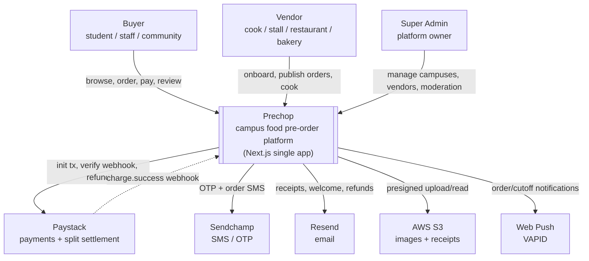
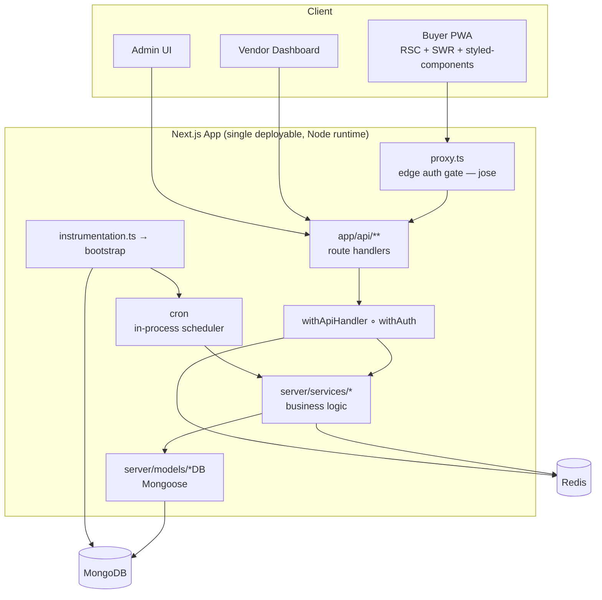
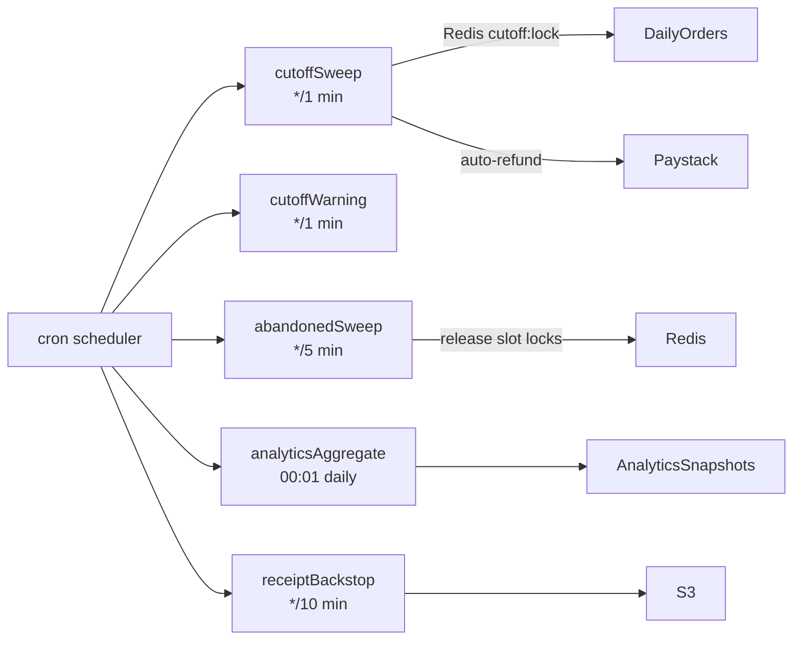
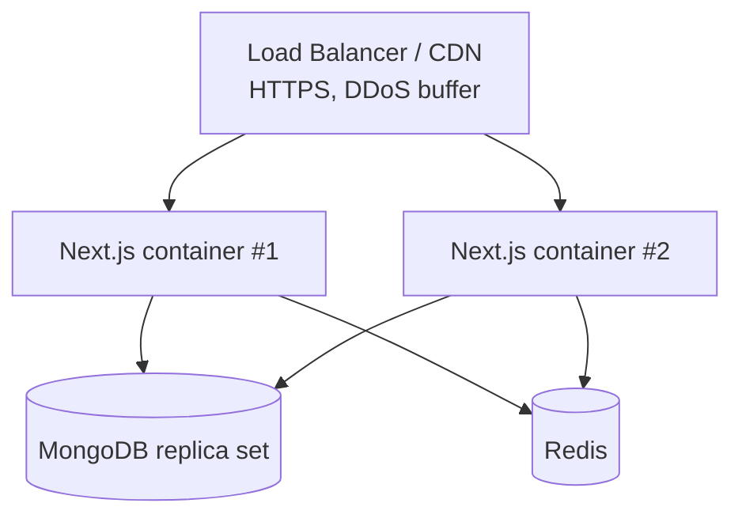

# 02 — C4 Diagrams

Diagrams use the [C4 model](https://c4model.com) levels: Context → Container → Component.
All are ASCII/Mermaid so they render in any viewer and stay in version control.

---

## Level 1 — System Context



---

## Level 2 — Container



Note there is **one** application container. The dashed "worker" box that existed in
`prechop-api` is deleted; its responsibilities live inside `Cron` and in fire-and-forget calls
from `Services`.

---

## Level 3 — Component: the Buyer-Order / Payment slice

This is the transactional heart of the system.

```mermaid
graph TD
    Route["/api/orders route.ts"]
    OrderSvc[buyerOrder.service<br/>placeOrder / cancel / webhook]
    Locks[Redis slot locks<br/>SET NX slot:lock:{item}:{order}]
    Paystack[paystack.provider<br/>init / verify / refund]
    OrderModel[buyerOrders *DB]
    DailyModel[dailyOrders *DB]
    PayModel[payments *DB]
    Notify[notification.service<br/>void notify]
    Audit[audit.service<br/>void recordAuditEvent]

    Route --> OrderSvc
    OrderSvc -->|check + hold slots| Locks
    OrderSvc -->|init tx BEFORE db write| Paystack
    OrderSvc -->|one transaction: order+items+payment| OrderModel
    OrderSvc --> DailyModel
    OrderSvc --> PayModel
    OrderSvc -.->|on webhook charge.success| Notify
    OrderSvc -.-> Audit
```

Key rules encoded here (see `product/03-business-rules.md`):
- Slots are **checked and held** in Redis (`SET NX`, 10-min TTL) *before* the DB write.
- Paystack init happens **before** the DB write; on failure the acquired locks are released.
- The order + items + addons + payment are persisted in **one transaction**.
- Locks are **not** released after a successful init — they persist until the webhook confirms payment or the 10-min TTL expires.

---

## Level 3 — Component: Background work (cron)



Every mutating cron job takes a Redis lock so that, under horizontal scaling, only one instance
performs the work per tick.

---

## Deployment view



See `architecture/05-deployment-infrastructure.md` for the concrete build and hosting targets.
