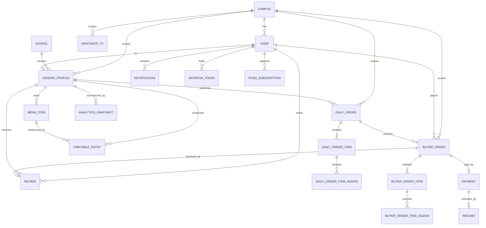

# 01 — Data Model (Mongoose / MongoDB)

This is the authoritative data model for the merged app. It is the **translation** of the former
Prisma/PostgreSQL schema into Mongoose collections. The field-by-field mapping (types, relations,
enums) is in `04-prisma-to-mongoose-migration.md`; this document is the target state.

## Conventions

- **IDs:** Mongo `ObjectId` (`_id`); aggregation reads expose `id: $toString($_id)`.
- **Money:** integer **kobo** everywhere (`*Kobo` suffix).
- **Enums:** stored as string unions (Mongoose `enum`), same values as the old Prisma enums.
- **Relations:** referenced by `ObjectId` (`ref`), populated via `$lookup`/`populate`; a small
  number of one-to-many item lists are **embedded** where they are always read with their parent
  (see "Embed vs reference" below).
- **Soft delete:** `deleted: boolean` + a `pre("aggregate")` hook that filters `deleted:false`.
- **Timestamps:** `{ timestamps: true }` → `createdAt` / `updatedAt`.
- **PII encryption:** `phone` and `accountNumber` stored AES-256-GCM encrypted; `whatsappNumber`
  encrypted too (Phase-2-ready).
- **Tenancy:** `campusId` denormalized onto every tenant-scoped document and indexed.

## Enumerations

| Enum | Values |
|---|---|
| `UserRole` | `BUYER` · `VENDOR` · `SUPER_ADMIN` |
| `VendorType` | `STUDENT_COOK` · `CAMPUS_STALL` · `RESTAURANT` · `BAKERY` (cosmetic tag) |
| `VendorStatus` | `INCOMPLETE` · `ACTIVE` · `SUSPENDED` |
| `LocationType` | `ON_CAMPUS` · `OFF_CAMPUS` |
| `MenuCategory` | `MEALS` · `SNACKS` · `DRINKS` · `BAKED_GOODS` |
| `DailyOrderStatus` | `DRAFT` · `ACTIVE` · `CLOSED` · `CANCELLED` |
| `OrderStatus` | `PENDING_PAYMENT` · `PAID` · `CONFIRMED` · `PREPARING` · `READY` · `COMPLETED` · `CANCELLED` · `REFUNDED` |
| `FulfillmentType` | `PICKUP` · `DELIVERY` |
| `PaymentStatus` | `INITIALIZED` · `SUCCESS` · `FAILED` · `ABANDONED` · `REFUNDED` |
| `DayOfWeek` | `MONDAY` … `SUNDAY` |

## Collections

### `campuses`
Top-level tenancy anchor.
`name`, `shortCode` (unique), `state`, `isActive`. Indexed: `shortCode`.

### `schools`
Reference list for ON_CAMPUS vendor location.
`name` (unique), `state`, `type` ("University" | "Polytechnic" | "College of Education"), `isActive`.

### `users`
Phone is identity; **no email/password**.
`campusId` (ref, indexed), `role` (default `BUYER`, indexed), `firstName`, `lastName`,
`phone` (unique, encrypted), `isPhoneVerified`, `isActive`, `lastLoginAt`.

### `refreshTokens`
`userId` (ref, cascade on user delete), `tokenHash` (SHA-256, unique), `deviceFingerprint`,
`expiresAt`, `usedAt?`, `revokedAt?`. Single-use, rotated, reuse-detected.
> Alternatively embeddable on the user doc as a capped `{ tokenHash, deadline }[]` array
> (managerenta style, cap 3). Either is acceptable; a separate collection is chosen here to
> preserve the existing reuse-detection semantics. See migration doc.

### `vendorProfiles`
`userId` (unique ref), `campusId` (ref, indexed), `vendorType?`, `businessName?`, `description?`,
`email` (unique), `status` (default `INCOMPLETE`, indexed), `locationType?`, `schoolId?`,
`schoolNameOther?`, `hostelOrStallName?`, `state?`, `areaOrAddress?`, `profileImageUrl?`,
`categories: MenuCategory[]`, `paystackSubaccountCode?`, `bankCode?`, `bankName?`,
`accountNumber?` (encrypted), `accountName?`, `rating` (0), `totalReviews`, `totalOrders`,
`completionRate`, `profileCompleteness` (default 10), `isOpenForOrders` (default false).

### `menuItems`
`vendorId` (ref, indexed), `campusId` (indexed), `category`, `name`, `description?`,
`priceKobo`, `imageUrl?`, `estimatedPrepMin` (20), `isAvailable`, `isSoldOut`, `displayOrder`,
`deleted` (soft-delete).

### `timetableEntries`
`vendorId` (ref, indexed), `menuItemId` (ref), `dayOfWeek`, `isOpen`.
Unique compound: `(vendorId, menuItemId, dayOfWeek)`.

### `dailyOrders`
A published listing for a date.
`vendorId` (ref), `campusId` (ref), `shareableToken` (unique), `title`, `scheduledDate`,
`cutoffTime`, `status` (default `DRAFT`), `isPublic`, `pickupAvailable` (true),
`deliveryAvailable` (false), `deliveryFeeKobo`, `totalOrdersCount`.
**Embeds `items: DailyOrderItem[]`** (see below).
Indexed: `(campusId, status)`, `(campusId, scheduledDate)`, `shareableToken`.

#### `DailyOrderItem` (embedded subdocument)
Snapshotted at publish: `menuItemId` (ref), `snapshotName`, `snapshotPriceKobo`,
`snapshotImageUrl?`, `snapshotPrepMin`, `maxQuantity?` (null = unlimited), `orderedQuantity` (0),
`addons: DailyOrderItemAddon[]` (`name`, `priceKobo`, `displayOrder`).

### `buyerOrders`
A placed order against a daily order.
`orderNumber` (unique, `PCH-YYYY-xxxxxx`), `dailyOrderId` (ref, indexed), `vendorId` (indexed),
`buyerId` (ref, indexed), `campusId` (indexed), `status` (default `PENDING_PAYMENT`, indexed),
`fulfillmentType`, `deliveryHostelName?`, `deliveryRoomNumber?`, `deliveryAdditionalInfo?`,
`deliveryFullAddress?`, `subtotalKobo`, `deliveryFeeKobo`, `platformFeeKobo`, `totalKobo`,
`cancellationReason?`, `cancelledBy?`, `receiptUrl?`.
**Embeds `items: BuyerOrderItem[]`** each: `dailyOrderItemId` (ref), `menuItemId`, `snapshotName`,
`snapshotPriceKobo`, `quantity`, `subtotalKobo`, `addons: BuyerOrderItemAddon[]`
(`dailyOrderItemAddonId`, `snapshotName`, `snapshotPriceKobo`, `quantity`, `subtotalKobo`).

### `payments`
`buyerOrderId` (unique ref), `buyerId`, `vendorId`, `paystackRef` (unique),
`paystackAccessCode`, `amountKobo`, `platformFeeKobo`, `vendorAmountKobo`,
`status` (default `INITIALIZED`), `channel?`, `paidAt?`, `webhookVerified` (false),
`idempotencyKey` (unique).

### `refunds`
`paymentId` (unique ref), `amountKobo`, `reason`, `paystackRefundId?`, `processedAt?`.

### `reviews`
`buyerOrderId` (unique ref), `vendorId` (ref, indexed), `buyerId` (ref, indexed), `rating` (1–5),
`comment?`, `tags: string[]`, `isFlagged`.

### `notifications`
`userId` (ref, indexed with `isRead`), `title`, `body`, `type`, `data?` (Mixed), `isRead`.

### `pushSubscriptions`
`userId` (ref), `endpoint`, `keys: { p256dh, auth }`, `userAgent?`. Pruned on 404/410 from push.

### `auditLogs`
Append-only. `userId` (ref, indexed), `role`, `action`, `resourceType`, `resourceId`
(indexed together), `previousState?`, `newState?`, `ipAddress`, `userAgent`.

### `analyticsSnapshots`
`vendorId` (ref, indexed), `date`, `totalOrders`, `completedOrders`, `cancelledOrders`,
`totalRevenueKobo`, `avgOrderValueKobo`, `topItemIds: string[]`, `peakHour?`, `newReviewCount`,
`avgRatingForDay?`. Unique compound: `(vendorId, date)`.

### `whatsappTvs`
`campusId` (ref, indexed with `isActive`), `name`, `whatsappNumber` (encrypted; validated
`^234[789]\d{9}$`, `+` stripped), `audienceSize`, `priceRange`, `isActive` (default true),
`displayOrder`. **Never hard-deleted** — soft via `isActive:false` (Phase-2 migration safety).

### `siteConfigs`
Single document of runtime policy. See `architecture/06-config-reference.md`.

## Embed vs reference — the decision

| Relationship | Choice | Why |
|---|---|---|
| DailyOrder → items/addons | **embed** | always read with the parent; snapshot lifecycle is bound to the parent; bounded size |
| BuyerOrder → items/addons | **embed** | same; an order's lines are never queried independently |
| BuyerOrder → Payment | **reference** (1:1) | payment is written/updated on a different lifecycle (webhook) and queried by `paystackRef` |
| Vendor → MenuItems | **reference** | menu items are a large, independently-queried, soft-deletable catalog |
| Vendor → DailyOrders / BuyerOrders | **reference** | high-cardinality, queried by many axes (campus, status, date) |
| User ↔ VendorProfile | **reference** (1:1) | different access patterns and roles |

Rule of thumb (matches managerenta): embed when the child is only ever read through its parent and
is bounded; reference when the child is queried on its own or grows unbounded.

## ERD

