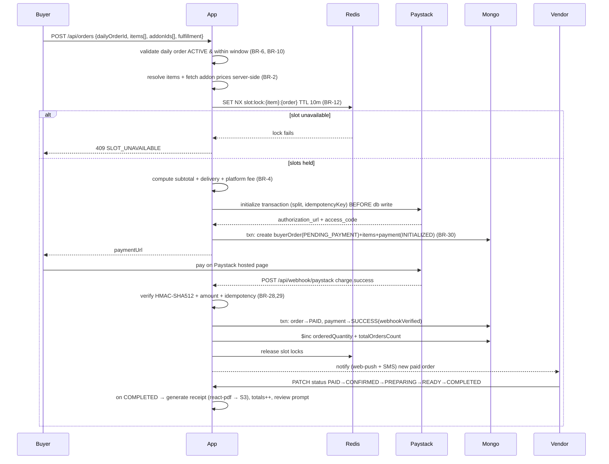
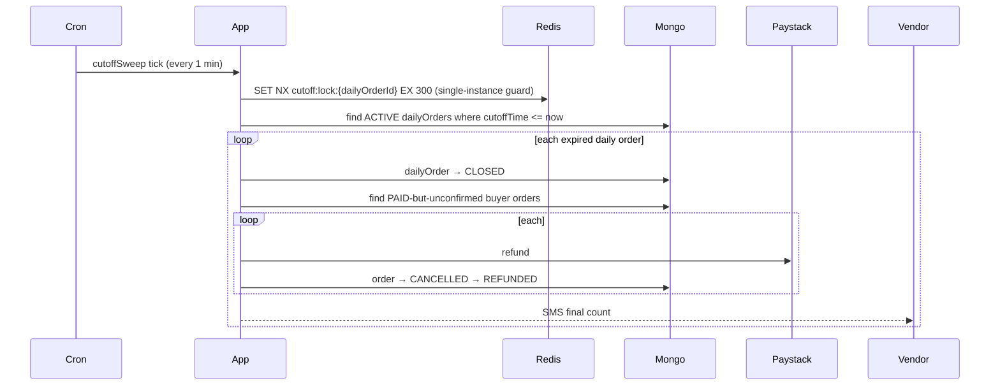
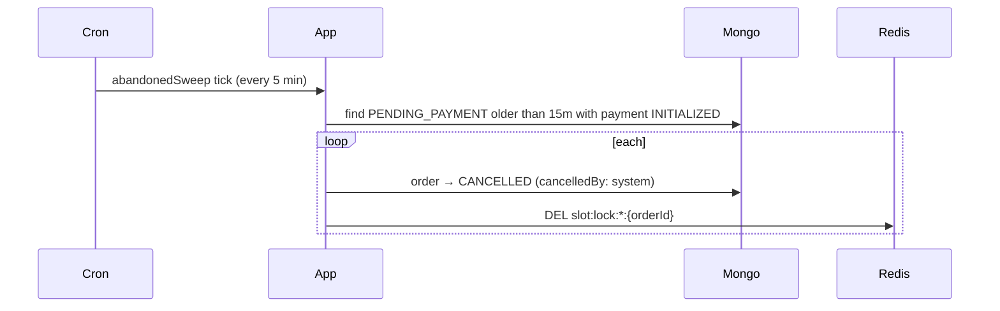
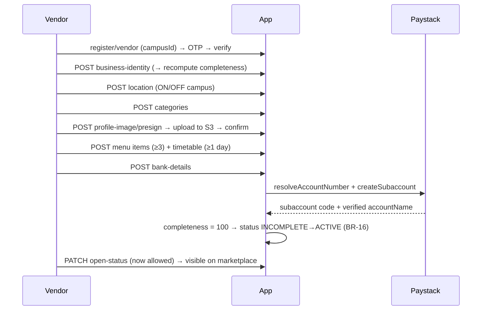
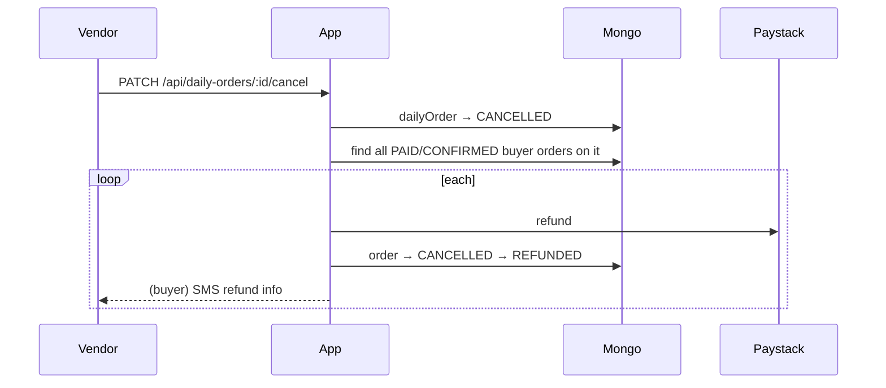
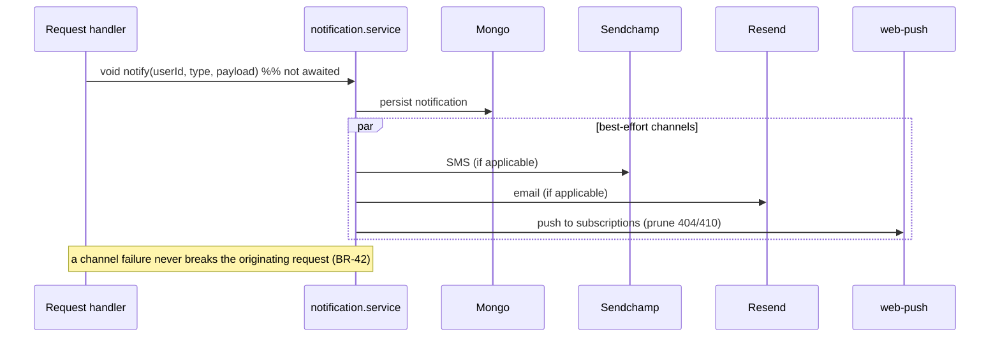

# 04 — Sequence Flows

The key end-to-end flows as sequence diagrams. Actors: **Buyer**, **Vendor**, **App** (Next.js
route → service → model), **Redis**, **Paystack**, **Mongo**, **Cron**.

## 1. Place order → pay → cook → complete (the happy path)



## 2. Cutoff enforcement (cron reconciler)



Because the API already blocks late orders synchronously (BR-6), a ≤1-minute sweep lag is
harmless — no buyer can slip in after cutoff.

## 3. Abandoned-order sweep



## 4. Vendor onboarding → auto-activation



## 5. Buyer/vendor cancellation with refund

```mermaid
sequenceDiagram
    participant Actor as Buyer or Vendor
    participant App
    participant PS as Paystack
    participant M as Mongo
    participant Other as Counterparty

    Actor->>App: cancel order
    App->>App: assert status in {PAID, CONFIRMED} (BR-31)
    App->>PS: refund(amountKobo incl. delivery fee)
    alt refund ok
        PS-->>App: refund id
        App->>M: order→CANCELLED→REFUNDED, refund record
        App-->>Other: SMS + email refund info
    else refund fails
        App->>M: log failure (surfaced for manual review, not swallowed)
        App-->>Actor: error (retryable)
    end
```

## 6. Daily-order cancellation (bulk refund)



## 7. Review submission

```mermaid
sequenceDiagram
    participant B as Buyer
    participant App
    participant M as Mongo
    participant V as Vendor

    Note over App: 24h after COMPLETED, buyer gets a review prompt
    B->>App: POST /api/reviews {buyerOrderId, rating, tags, comment?}
    App->>App: assert order COMPLETED, no existing review, within 72h (BR-33,34)
    App->>M: create review; recompute vendor rating/totalReviews
    App-->>V: notify new review (rating hidden until ≥5 — BR-36)
```

## 8. Notification fan-out (fire-and-forget)


